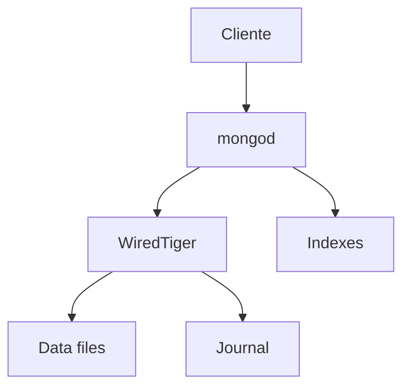

# Arquitectura interna

MongoDB almacena documentos BSON en colecciones. Su arquitectura gira alrededor de documentos, indices, replica sets, journaling y, si hace falta, sharding.

## Componentes



## BSON

BSON es una representacion binaria de documentos similar a JSON, con tipos adicionales como fechas, ObjectId y binarios.

## WiredTiger

WiredTiger es el motor de almacenamiento habitual. Aporta compresion, cache, journaling y concurrencia a nivel de documento.

## Documentos y colecciones

Una coleccion contiene documentos flexibles, pero eso no significa ausencia de diseño.

La flexibilidad debe controlarse con:

- Validacion de schema.
- Convenciones de campos.
- Indices.
- Patrones de modelado.

## Indices

MongoDB usa indices para evitar escaneos de coleccion.

```javascript
db.pedidos.createIndex({ cliente_id: 1, creado_en: -1 })
```

## Journal

El journal ayuda a recuperar escrituras tras fallos.

## Buenas practicas

- Modela segun consultas.
- Crea indices para patrones reales.
- Evita documentos que crecen sin limite.
- Usa replica sets en produccion.
- Monitoriza cache, locks e indices.
