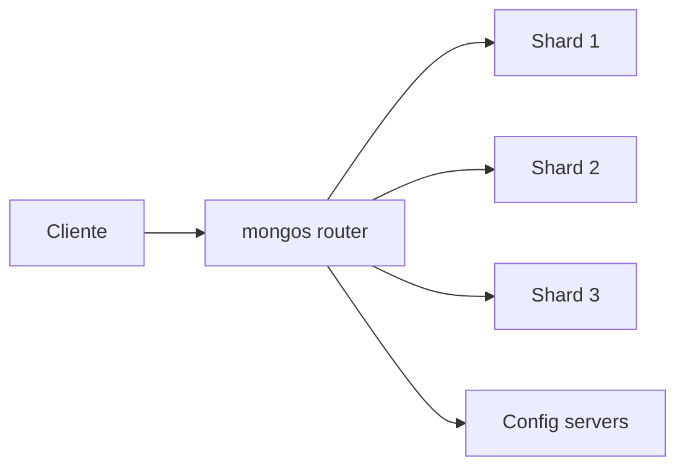

# Sharding avanzado

Sharding reparte datos entre shards para escalar almacenamiento y throughput, pero añade complejidad operativa.

## Arquitectura

## Shard key

La shard key decide distribucion.

Una mala shard key puede causar:

- Hot shard.
- Chunks desequilibrados.
- Consultas scatter-gather.

## Elegir shard key

Debe tener:

- Alta cardinalidad.
- Buena distribucion.
- Presencia en consultas frecuentes.
- Evitar crecimiento monotono concentrado si no hay estrategia.

## Scatter-gather

Si una consulta no usa shard key, puede consultar todos los shards.

## Buenas practicas

- No actives sharding sin necesidad real.
- Diseña shard key con datos de produccion.
- Monitoriza balanceo.
- Evita claves monotonicamente crecientes sin mitigacion.
- Prueba consultas principales en entorno sharded.
