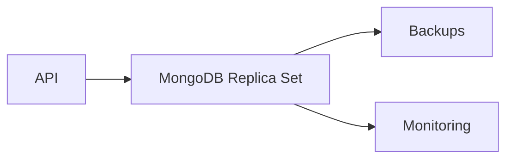

# Proyecto final

El objetivo es diseñar MongoDB para un catalogo y pedidos: documentos, indices, agregaciones, replica set, backups y observabilidad.

## Arquitectura



## Coleccion productos

```javascript
db.productos.insertOne({
  sku: "KB-001",
  nombre: "Teclado",
  precio: 49.99,
  stock: 20,
  categorias: ["perifericos"],
  atributos: {
    idioma: "ES",
    mecanico: true
  }
})
```

## Coleccion pedidos

```javascript
db.pedidos.insertOne({
  cliente_id: "c1",
  estado: "confirmado",
  creado_en: new Date(),
  lineas: [
    { sku: "KB-001", cantidad: 1, precio: 49.99 }
  ]
})
```

## Indices

```javascript
db.productos.createIndex({ sku: 1 }, { unique: true })
db.productos.createIndex({ categorias: 1, precio: 1 })
db.pedidos.createIndex({ cliente_id: 1, creado_en: -1 })
```

## Agregacion

```javascript
db.pedidos.aggregate([
  { $unwind: "$lineas" },
  { $group: { _id: "$cliente_id", total: { $sum: "$lineas.precio" } } }
])
```

## Entregable

- Modelo de productos y pedidos.
- Indices justificados.
- Aggregation pipeline de ventas.
- Estrategia de replica set.
- Backup y restore probado.
- Explain de consultas principales.
- Checklist de produccion.
