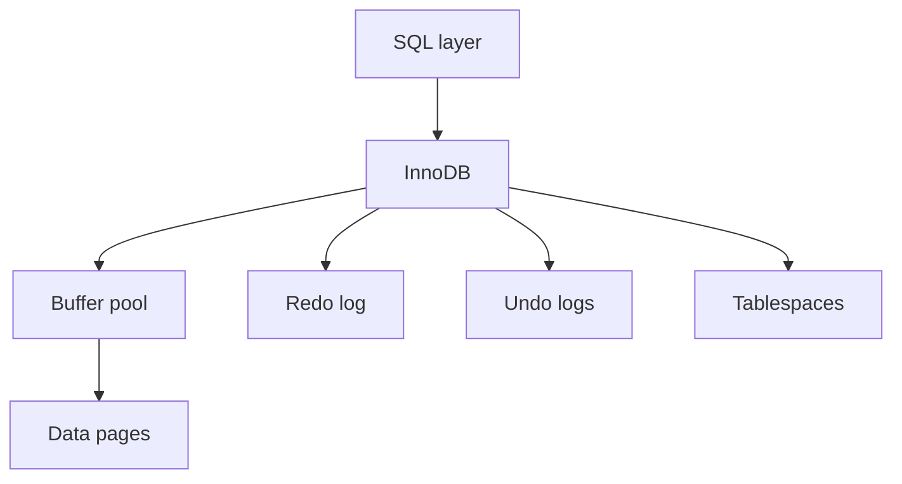

# Arquitectura interna de InnoDB

InnoDB es el motor de almacenamiento principal de MySQL. Aporta transacciones ACID, claves foraneas, indices B-Tree, bloqueos por fila y recuperacion ante fallos.

## Arquitectura conceptual



## SQL layer y storage engine

MySQL separa:

- Capa SQL: parser, optimizer, permisos, funciones SQL.
- Motor de almacenamiento: lectura/escritura fisica, indices, transacciones.

InnoDB es el motor mas habitual para aplicaciones transaccionales.

## Buffer pool

El buffer pool cachea paginas de datos e indices en memoria.

Variable importante:

```sql
SHOW VARIABLES LIKE 'innodb_buffer_pool_size';
```

En servidores dedicados a MySQL, suele ser una de las configuraciones mas importantes.

## Paginas

InnoDB trabaja con paginas, normalmente de 16 KB. Las filas e indices se almacenan en paginas.

Esto explica por que los indices y el orden fisico afectan lecturas.

## Clustered index

En InnoDB, la primary key es el clustered index. Los datos de la fila viven ordenados por la primary key.

Si no defines primary key, InnoDB crea una interna. Es mejor definir una explicitamente.

## Indices secundarios

Un indice secundario guarda la clave indexada y la primary key de la fila.

Por eso primary keys enormes aumentan el tamaño de indices secundarios.

## Redo log

El redo log permite recuperar cambios confirmados tras fallo.

Flujo simplificado:

```txt
cambio en memoria -> redo log -> flush a datos
```

## Undo log

El undo log permite:

- Rollback.
- Lecturas consistentes mediante MVCC.

## Change buffer

InnoDB puede diferir cambios de indices secundarios para optimizar escrituras.

No suele configurarse a diario, pero ayuda a entender rendimiento de escrituras.

## Buenas practicas

- Define primary keys pequenas y estables.
- Usa InnoDB salvo razon clara.
- Dimensiona buffer pool con datos reales.
- Entiende que indices secundarios incluyen la primary key.
- No optimices configuracion sin medir.

