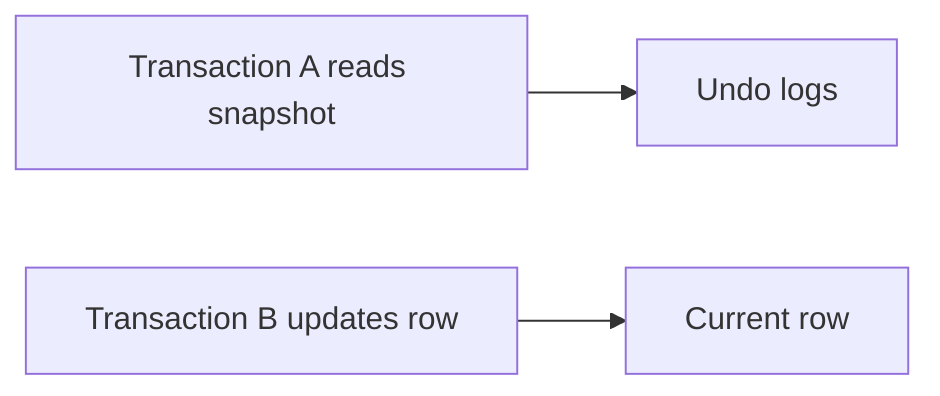

# Locks, MVCC y niveles de aislamiento

MySQL con InnoDB permite concurrencia alta gracias a MVCC y bloqueos por fila, pero las transacciones mal diseñadas pueden causar esperas, deadlocks y lecturas inesperadas.

## MVCC

MVCC permite que una transaccion lea una version consistente sin bloquear escrituras normales.



## Niveles de aislamiento

Ver nivel actual:

```sql
SELECT @@transaction_isolation;
```

Niveles comunes:

- `READ COMMITTED`
- `REPEATABLE READ`
- `SERIALIZABLE`

MySQL usa `REPEATABLE READ` por defecto en muchas instalaciones.

## Lectura consistente

Una consulta normal:

```sql
SELECT * FROM pedidos WHERE id = 10;
```

No bloquea la fila en condiciones normales. Lee una version consistente.

## Lectura con bloqueo

```sql
SELECT * FROM pedidos WHERE id = 10 FOR UPDATE;
```

Bloquea para modificar de forma segura dentro de la transaccion.

## Gap locks

En ciertos niveles de aislamiento, InnoDB puede bloquear rangos para evitar phantom reads.

Esto puede sorprender en consultas por rango:

```sql
SELECT * FROM reservas
WHERE sala_id = 1 AND fecha = '2026-06-26'
FOR UPDATE;
```

## Deadlocks

Un deadlock ocurre cuando dos transacciones esperan recursos entre si.

```txt
T1 bloquea A y espera B
T2 bloquea B y espera A
```

InnoDB detecta deadlocks y cancela una transaccion.

## Diagnostico

```sql
SHOW ENGINE INNODB STATUS;
```

Tambien revisa Performance Schema para esperas y locks.

## Buenas practicas

- Mantén transacciones cortas.
- Accede a tablas en el mismo orden.
- Indexa filtros usados en updates/deletes.
- No esperes input externo dentro de una transaccion.
- Maneja deadlocks con reintentos controlados.
- Usa `FOR UPDATE` solo cuando sea necesario.

