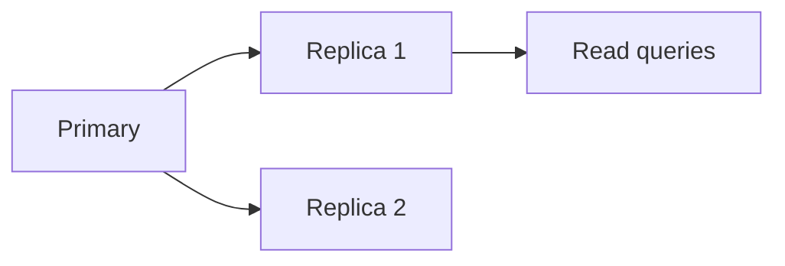

# Binlog, replicacion y alta disponibilidad

El binary log registra cambios y permite replicacion, recuperacion point-in-time e integracion con herramientas CDC.

## Binary log

Activar binlog permite guardar eventos de cambios.

Ver estado:

```sql
SHOW VARIABLES LIKE 'log_bin';
SHOW BINARY LOGS;
```

## Formatos

- Statement-based.
- Row-based.
- Mixed.

Para replicacion y CDC, row-based suele ser mas predecible.

## Replicacion

Arquitectura basica:



El primario recibe escrituras. Las replicas aplican cambios desde binlog.

## Replica lag

El lag indica retraso de replica respecto al primario.

```sql
SHOW REPLICA STATUS\G
```

Revisa `Seconds_Behind_Source` o metricas equivalentes segun version.

## Lecturas en replicas

Las replicas pueden descargar lecturas, pero cuidado:

- Puede haber datos atrasados.
- No leas inmediatamente despues de escribir si necesitas consistencia fuerte.
- Decide estrategia por caso.

## Point-in-time recovery

Backups + binlogs permiten restaurar hasta un momento concreto.

```txt
restore backup completo -> aplicar binlogs hasta timestamp
```

## Alta disponibilidad

Opciones:

- Replicacion con failover manual.
- Orchestrator.
- MySQL InnoDB Cluster.
- Servicios gestionados cloud.

## Buenas practicas

- Activa binlog si necesitas replicacion o PITR.
- Monitoriza lag.
- Prueba failover.
- Prueba restore con binlogs.
- No confundas replica con backup.
- Documenta que lecturas pueden ir a replica.

