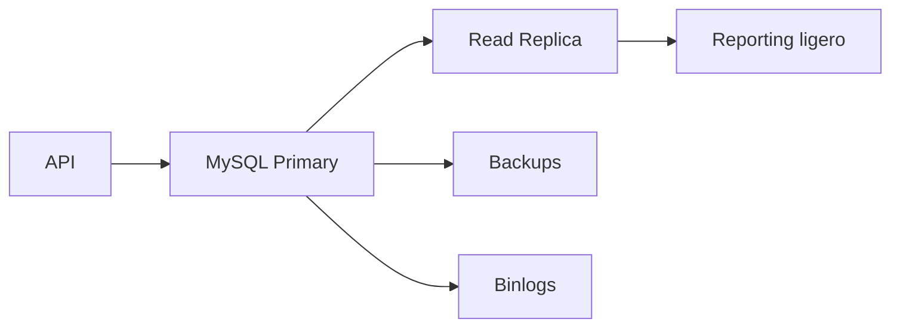

# Proyecto final

El objetivo es diseñar y operar una base MySQL para una tienda online: modelo, indices, transacciones, backups, rendimiento y replicacion.

## Arquitectura



## Modelo

```sql
CREATE TABLE clientes (
  id BIGINT AUTO_INCREMENT PRIMARY KEY,
  email VARCHAR(190) NOT NULL UNIQUE,
  nombre VARCHAR(120) NOT NULL,
  creado_en TIMESTAMP NOT NULL DEFAULT CURRENT_TIMESTAMP
) ENGINE=InnoDB;

CREATE TABLE productos (
  id BIGINT AUTO_INCREMENT PRIMARY KEY,
  sku VARCHAR(80) NOT NULL UNIQUE,
  nombre VARCHAR(160) NOT NULL,
  precio DECIMAL(12,2) NOT NULL,
  stock INT NOT NULL DEFAULT 0,
  CHECK (precio >= 0),
  CHECK (stock >= 0)
) ENGINE=InnoDB;

CREATE TABLE pedidos (
  id BIGINT AUTO_INCREMENT PRIMARY KEY,
  cliente_id BIGINT NOT NULL,
  estado VARCHAR(30) NOT NULL,
  creado_en TIMESTAMP NOT NULL DEFAULT CURRENT_TIMESTAMP,
  CONSTRAINT fk_pedidos_clientes FOREIGN KEY (cliente_id) REFERENCES clientes(id)
) ENGINE=InnoDB;
```

## Indices

```sql
CREATE INDEX idx_pedidos_cliente_fecha
ON pedidos(cliente_id, creado_en);

CREATE INDEX idx_pedidos_estado_fecha
ON pedidos(estado, creado_en);
```

## Transaccion de compra

```sql
START TRANSACTION;

SELECT stock
FROM productos
WHERE id = 10
FOR UPDATE;

UPDATE productos
SET stock = stock - 1
WHERE id = 10 AND stock > 0;

INSERT INTO pedidos (cliente_id, estado)
VALUES (1, 'confirmado');

COMMIT;
```

## Consultas a optimizar

```sql
EXPLAIN ANALYZE
SELECT *
FROM pedidos
WHERE cliente_id = 1
ORDER BY creado_en DESC
LIMIT 20;
```

## Backup y restore

```bash
mysqldump -u root -p --single-transaction app_db > app_db.sql
mysql -u root -p app_db_restore < app_db.sql
```

## Observabilidad

Vigila:

- Slow queries.
- Deadlocks.
- Replica lag.
- Conexiones.
- Disco.
- Buffer pool.

## Entregable

El proyecto debe incluir:

- Modelo relacional con constraints.
- Indices justificados.
- Transaccion segura para compras.
- Consultas analizadas con `EXPLAIN`.
- Backup y restore probado.
- Politica de usuarios.
- Plan de replicacion o restore.
- Checklist de produccion.

