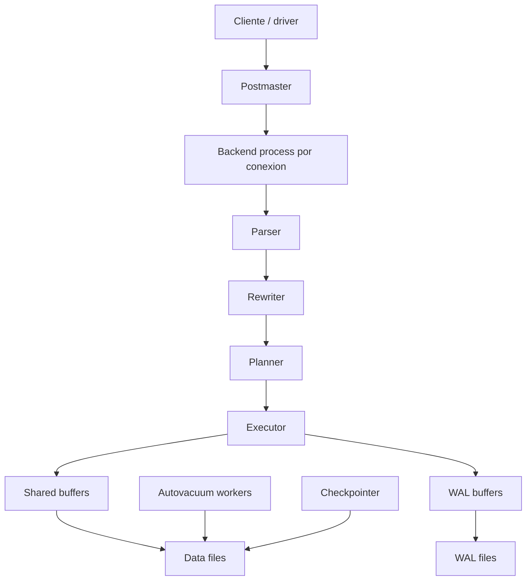

# Arquitectura interna

PostgreSQL no es solo un binario que acepta SQL. Por dentro coordina procesos, memoria compartida, archivos de datos, WAL, autovacuum, locks y un optimizador de consultas.

## Diagrama general



## Postmaster y procesos backend

El proceso principal acepta conexiones y crea procesos backend para atender sesiones.

Cada conexion consume recursos. Por eso, en aplicaciones reales se usa un pool como PgBouncer o el pool del framework.

## Parser, rewriter, planner y executor

Flujo de una consulta:

```txt
SQL -> parse -> rewrite -> plan -> execute -> rows
```

- **Parser:** valida sintaxis.
- **Rewriter:** aplica reglas y vistas.
- **Planner:** elige plan de ejecucion.
- **Executor:** ejecuta el plan.

## Shared buffers

`shared_buffers` es una zona de memoria compartida donde PostgreSQL cachea paginas de datos.

Si una pagina esta en memoria, se evita leer del disco. Si no esta, se carga desde los archivos de datos.

## WAL

Antes de confirmar cambios en datos, PostgreSQL escribe informacion suficiente en el Write-Ahead Log para poder recuperar consistencia tras fallos.

```txt
cambio -> WAL -> commit -> data files mas tarde
```

## Background processes

Procesos importantes:

- **checkpointer:** fuerza escritura de datos sucios.
- **background writer:** ayuda a escribir paginas modificadas.
- **walwriter:** escribe WAL buffers.
- **autovacuum launcher/workers:** limpian versiones antiguas y actualizan estadisticas.
- **stats collector / shared stats:** metricas internas.

## Archivos de datos

Las tablas e indices se almacenan como archivos en el data directory. El usuario no debe modificarlos manualmente.

## Buenas practicas

- Usa pool de conexiones.
- Monitoriza conexiones activas.
- Entiende si un problema es CPU, I/O, locks o memoria.
- No ajustes parametros globales sin medir.
- Revisa logs y vistas `pg_stat_*`.

## Errores comunes

- Abrir cientos de conexiones directas.
- Pensar que `shared_buffers` debe usar toda la RAM.
- Ignorar WAL en estrategias de backup.
- No entender el papel de autovacuum.
