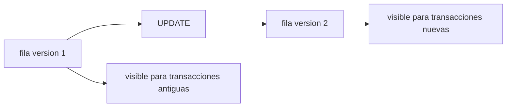

# MVCC y aislamiento

MVCC significa Multi-Version Concurrency Control. PostgreSQL permite que lectores y escritores trabajen a la vez manteniendo varias versiones de una fila.

## Idea central

Cuando una transaccion actualiza una fila, PostgreSQL no sobrescribe directamente la version visible. Crea una nueva version y marca metadatos de visibilidad.



## xmin y xmax

Cada fila tiene metadatos internos:

- `xmin`: transaccion que creo la version.
- `xmax`: transaccion que invalido o borro la version.

La visibilidad depende del snapshot de la transaccion que consulta.

## Snapshots

Un snapshot define que transacciones eran visibles en un momento.

Por eso una consulta puede no ver cambios confirmados despues de iniciar una transaccion, segun el nivel de aislamiento.

## Niveles de aislamiento

- `READ COMMITTED`: cada sentencia ve un snapshot nuevo.
- `REPEATABLE READ`: toda la transaccion mantiene snapshot estable.
- `SERIALIZABLE`: simula ejecucion serial y puede requerir reintentos.

```sql
BEGIN ISOLATION LEVEL REPEATABLE READ;
SELECT * FROM cuentas WHERE id = 1;
COMMIT;
```

## Lectores no bloquean escritores

Una de las ventajas de MVCC es que una lectura normal no bloquea una escritura normal, y una escritura no bloquea lecturas normales.

Pero si quedan versiones antiguas, hace falta vacuum para limpiar.

## Problemas que evita y problemas que no evita

MVCC ayuda con:

- Lecturas consistentes.
- Menos bloqueos entre lectura y escritura.
- Concurrencia alta.

No elimina:

- Deadlocks.
- Conflictos de escritura.
- Bloat.
- Necesidad de indices.

## Buenas practicas

- Manten transacciones cortas.
- Evita sesiones `idle in transaction`.
- Usa `SERIALIZABLE` solo cuando lo necesites.
- Prepara reintentos para conflictos.
- Monitoriza bloat y autovacuum.

## Errores comunes

- Dejar una transaccion abierta durante minutos.
- Pensar que MVCC evita todos los bloqueos.
- No entender por que una tabla crece tras muchos updates.
- No reintentar transacciones serializables fallidas.
