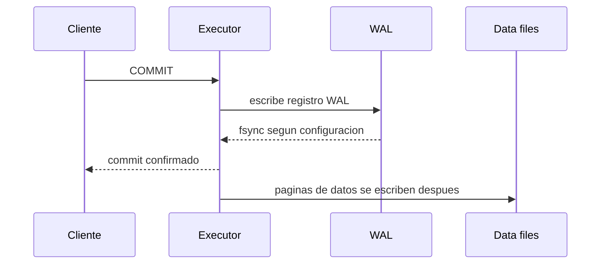

# WAL, checkpoints y recuperacion

WAL significa Write-Ahead Log. PostgreSQL escribe cambios en WAL antes de considerar confirmada una transaccion. Esto permite recuperar consistencia despues de un fallo.

## Flujo de escritura



## Por que WAL importa

WAL permite:

- Crash recovery.
- Replicacion fisica.
- Point-in-time recovery.
- Backups consistentes.

## Checkpoints

Un checkpoint marca un punto donde PostgreSQL asegura que muchas paginas sucias ya fueron escritas a disco.

Demasiados checkpoints pueden generar I/O intenso. Checkpoints muy separados pueden aumentar tiempo de recuperacion.

## Archiving

Para recuperacion a punto en el tiempo necesitas archivar WAL:

```conf
archive_mode = on
archive_command = 'cp %p /backups/wal/%f'
```

En produccion real conviene usar herramientas robustas como pgBackRest, Barman o soluciones gestionadas.

## Replicacion

La replicacion fisica envia WAL a replicas:

```txt
primary -> WAL stream -> standby
```

Las replicas reproducen cambios para mantenerse sincronizadas.

## Restauracion a punto en el tiempo

Necesitas:

- Backup base.
- WAL archivado.
- Objetivo de recuperacion.

Ejemplo conceptual:

```txt
restore backup base
replay WAL hasta 2026-06-26 10:30
abrir base recuperada
```

## Buenas practicas

- No hagas backups sin WAL si necesitas PITR.
- Monitoriza crecimiento de `pg_wal`.
- Prueba recuperacion.
- Vigila lag de replicas.
- Usa herramientas de backup especializadas.

## Errores comunes

- Borrar WAL manualmente.
- Llenar disco por archiving roto.
- Tener backup base sin WAL.
- No probar restore.
- Confundir replica con backup.
