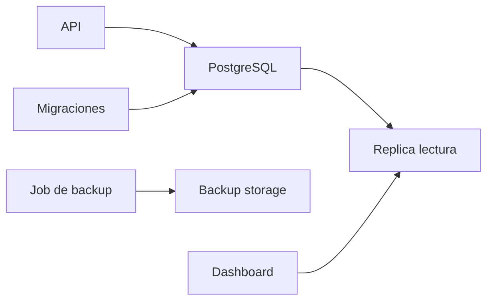

# Proyecto final

El objetivo es disenar, cargar, consultar, optimizar y operar una base PostgreSQL para una tienda online pequena. El proyecto conecta modelado, SQL, indices, transacciones, JSONB, backups y rendimiento.

## Arquitectura



## Modelo

```sql
CREATE TABLE clientes (
  id BIGSERIAL PRIMARY KEY,
  nombre TEXT NOT NULL,
  email TEXT NOT NULL UNIQUE,
  creado_en TIMESTAMPTZ NOT NULL DEFAULT now()
);

CREATE TABLE productos (
  id BIGSERIAL PRIMARY KEY,
  sku TEXT NOT NULL UNIQUE,
  nombre TEXT NOT NULL,
  precio NUMERIC(12,2) NOT NULL CHECK (precio >= 0),
  activo BOOLEAN NOT NULL DEFAULT true
);

CREATE TABLE pedidos (
  id BIGSERIAL PRIMARY KEY,
  cliente_id BIGINT NOT NULL REFERENCES clientes(id),
  estado TEXT NOT NULL DEFAULT 'pendiente',
  metadata JSONB NOT NULL DEFAULT '{}'::jsonb,
  creado_en TIMESTAMPTZ NOT NULL DEFAULT now()
);

CREATE TABLE pedido_lineas (
  pedido_id BIGINT NOT NULL REFERENCES pedidos(id),
  producto_id BIGINT NOT NULL REFERENCES productos(id),
  cantidad INT NOT NULL CHECK (cantidad > 0),
  precio_unitario NUMERIC(12,2) NOT NULL CHECK (precio_unitario >= 0),
  PRIMARY KEY (pedido_id, producto_id)
);
```

## Consulta principal

```sql
SELECT
  p.id,
  c.email,
  p.estado,
  SUM(pl.cantidad * pl.precio_unitario) AS total
FROM pedidos p
JOIN clientes c ON c.id = p.cliente_id
JOIN pedido_lineas pl ON pl.pedido_id = p.id
WHERE p.creado_en >= now() - interval '30 days'
GROUP BY p.id, c.email, p.estado
ORDER BY p.id DESC;
```

## Indices

```sql
CREATE INDEX idx_pedidos_cliente_fecha ON pedidos(cliente_id, creado_en DESC);
CREATE INDEX idx_pedidos_estado_fecha ON pedidos(estado, creado_en DESC);
CREATE INDEX idx_pedidos_metadata_gin ON pedidos USING gin(metadata);
```

## Transaccion de compra

```sql
BEGIN;

INSERT INTO pedidos (cliente_id, estado)
VALUES (1, 'pendiente')
RETURNING id;

INSERT INTO pedido_lineas (pedido_id, producto_id, cantidad, precio_unitario)
VALUES (1, 10, 2, 19.99);

UPDATE pedidos
SET estado = 'pagado'
WHERE id = 1;

COMMIT;
```

## Backup

```bash
pg_dump -Fc -d tienda -f tienda.dump
pg_restore -d tienda_restore tienda.dump
```

## Validaciones

- Ejecutar `EXPLAIN (ANALYZE, BUFFERS)` sobre consultas criticas.
- Probar rollback de una compra fallida.
- Insertar metadata JSONB y consultar por una clave.
- Restaurar backup en una base distinta.
- Revisar permisos del usuario de aplicacion.

## Requisitos de calidad

- Primary keys y foreign keys.
- Constraints para importes y cantidades.
- Indices justificados por consultas.
- Transacciones cortas.
- Usuario de aplicacion sin superusuario.
- Backup restaurado al menos una vez.
- Consultas medidas con datos de prueba.

## Mejoras opcionales

- Particionado por fecha en `pedidos`.
- Replica de lectura.
- PgBouncer.
- Auditoria de cambios.
- Migraciones con herramienta externa.
- Dashboard de metricas.

## Cierre

Si completas este proyecto, habras usado PostgreSQL como algo mas que "una base SQL": modelo relacional, integridad, JSONB, transacciones, indices, planes, backup y operacion basica.
