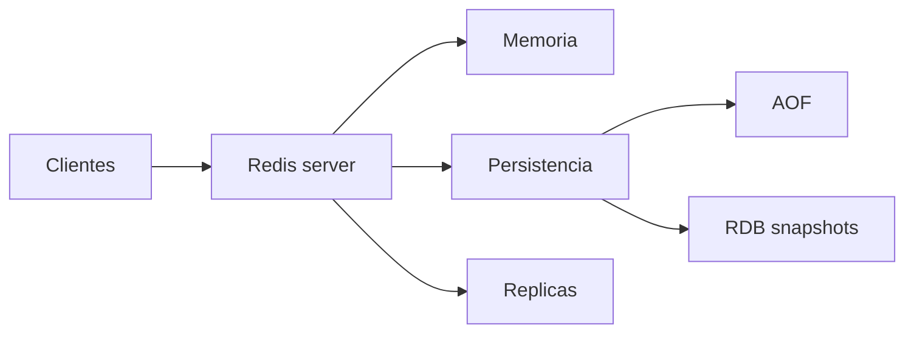
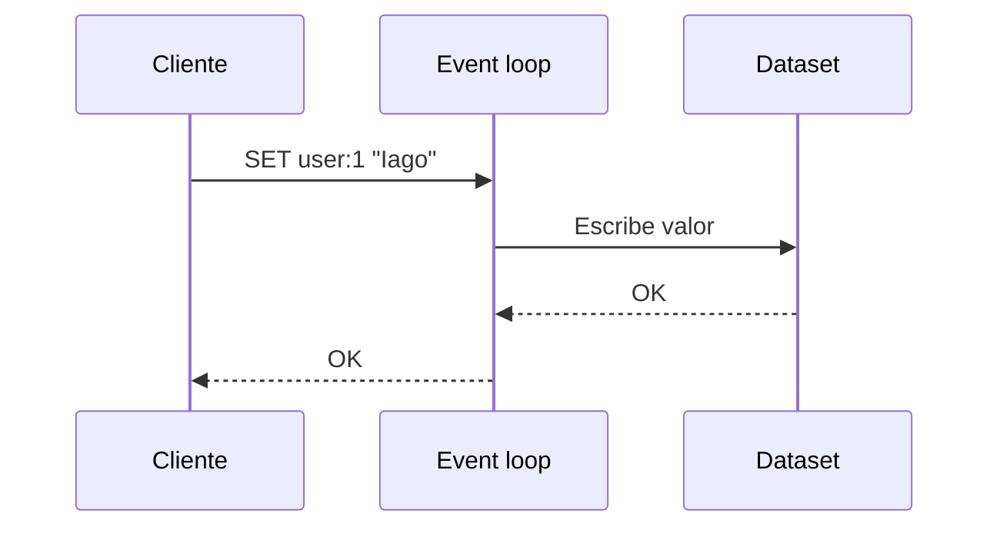
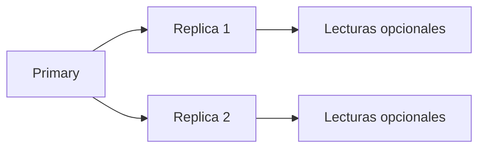

# Arquitectura interna

Redis es rapido porque su diseno evita muchas capas: mantiene el dataset en memoria, ejecuta comandos de forma muy eficiente y usa estructuras de datos optimizadas para cada tipo.

## Modelo general



## Proceso principal

Redis usa un proceso servidor que atiende conexiones, interpreta comandos y modifica estructuras en memoria.

Aunque Redis puede usar hilos auxiliares para algunas tareas, el modelo mental importante es que los comandos se procesan de forma ordenada. Eso simplifica la atomicidad: un comando individual no se entremezcla con otro.

## Event loop

Redis usa un bucle de eventos para manejar conexiones de red sin crear un hilo por cliente.



## Dataset en memoria

Redis guarda claves y valores en memoria. Cada clave apunta a un objeto Redis con tipo, encoding interno y metadata.

Tipos principales:

- Strings.
- Hashes.
- Lists.
- Sets.
- Sorted sets.
- Streams.
- HyperLogLog.
- Bitmaps.

## Encodings internos

Redis puede representar un mismo tipo de dato con estructuras internas distintas segun tamano y forma.

Ejemplos:

- Hash pequeno: representacion compacta.
- Hash grande: tabla hash.
- Sorted set pequeno: representacion compacta.
- Sorted set grande: skiplist + hash.

No necesitas controlar esto todos los dias, pero explica por que cambiar cardinalidades puede afectar memoria y rendimiento.

## Operaciones O(1), O(log n) y O(n)

No todos los comandos cuestan igual.

Ejemplos:

```txt
GET clave              O(1)
SET clave valor        O(1)
HGET hash campo        O(1)
ZADD ranking score id  O(log n)
LRANGE lista 0 -1      O(n)
KEYS *                 O(n)
```

En produccion, evita comandos que recorren todo el dataset.

## Expiraciones

Redis permite asociar TTL a claves.

```bash
SET token:abc "user-1" EX 900
TTL token:abc
```

Redis elimina claves expiradas de dos formas:

- Eliminacion pasiva cuando se accede a una clave caducada.
- Eliminacion activa muestreando claves con TTL.

## Persistencia

Redis puede persistir datos, pero su fortaleza sigue siendo la velocidad en memoria.

Opciones:

- RDB: snapshots periodicos.
- AOF: log de comandos de escritura.
- RDB + AOF: combinacion comun para mas seguridad.

## Replicacion

Una replica recibe datos del primario.



La replicacion mejora disponibilidad y puede descargar lecturas, pero no sustituye backups.

## Latencia

La latencia puede venir de:

- Comandos pesados.
- Memoria insuficiente.
- Swapping.
- Red.
- Persistencia mal configurada.
- Forks para snapshots en instancias grandes.

## Buenas practicas

- Conoce la complejidad de los comandos que usas.
- Evita `KEYS` en produccion; usa `SCAN`.
- Mantén Redis con memoria suficiente para evitar swap.
- Decide persistencia segun criticidad del dato.
- Monitoriza latencia, memoria y comandos lentos.

