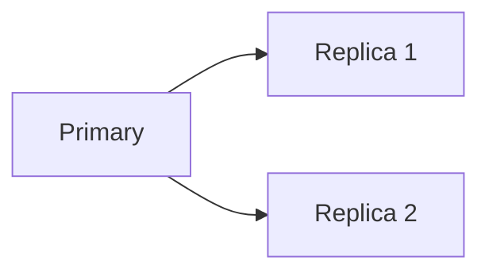
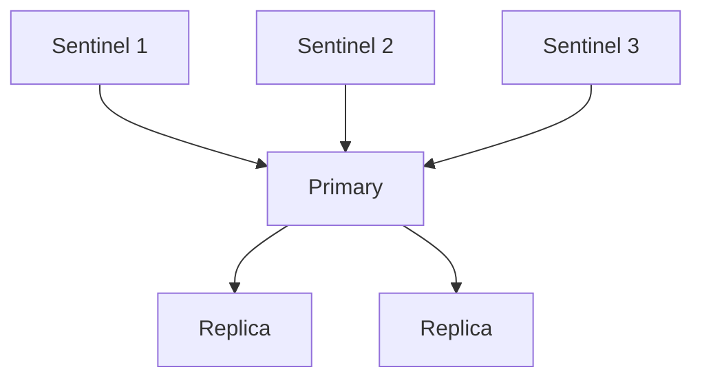
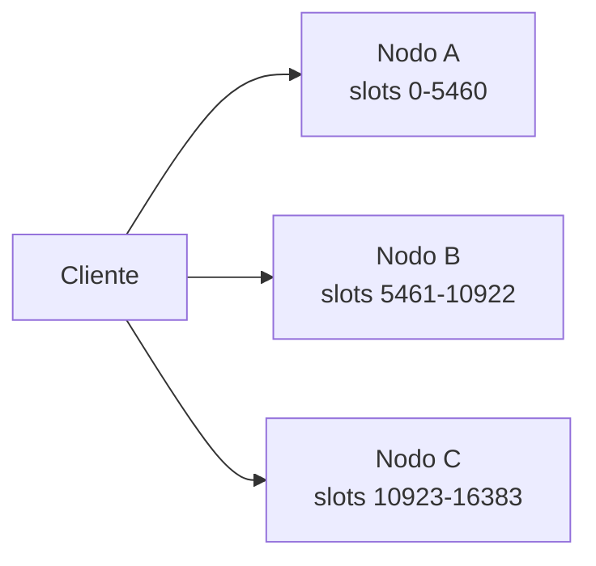

# Sentinel, Cluster y escalado

Redis puede crecer en disponibilidad y capacidad, pero cada opcion resuelve un problema distinto. Replica, Sentinel y Cluster no son sinonimos.

## Replicacion simple

Un primario replica datos a una o varias replicas.



Sirve para:

- Tener copia caliente.
- Descargar algunas lecturas.
- Preparar failover manual.

No resuelve automaticamente la promocion si cae el primario.

## Sentinel

Redis Sentinel monitoriza instancias y puede promover una replica si el primario falla.



Funciones:

- Monitorizacion.
- Deteccion de fallo.
- Eleccion de nuevo primario.
- Notificacion a clientes.

## Quorum

Sentinel necesita acuerdo para declarar caido un primario. Por eso se usan varias instancias Sentinel.

Configuracion conceptual:

```conf
sentinel monitor mymaster 10.0.0.10 6379 2
```

El `2` indica cuantos Sentinel deben estar de acuerdo.

## Redis Cluster

Redis Cluster distribuye claves entre nodos mediante hash slots.



Sirve para:

- Escalar memoria horizontalmente.
- Repartir escrituras.
- Mantener alta disponibilidad con replicas por master.

## Hash slots

Redis Cluster tiene 16384 slots. Cada clave pertenece a un slot.

Claves con hash tag:

```txt
pedido:{10}:datos
pedido:{10}:lineas
```

Ambas usan el mismo hash tag `{10}` y caen en el mismo slot. Es importante para operaciones multi-key.

## Limitaciones multi-key

En Cluster, operaciones con varias claves pueden fallar si las claves estan en slots distintos.

Ejemplo problematico:

```bash
MGET user:1 order:9
```

Si necesitas multi-key, disena claves con hash tags.

## Escalado vertical vs horizontal

Antes de usar Cluster, pregunta:

- El problema es memoria?
- El problema es CPU?
- El problema es red?
- El problema son comandos lentos?
- El modelo de claves soporta particionado?

Cluster anade complejidad. No lo uses solo porque suena mas avanzado.

## Backups y replicas

Replica no es backup. Si borras datos en el primario, el borrado se replica.

Necesitas:

- Snapshots.
- AOF si aplica.
- Copias externas.
- Pruebas de restore.

## Clientes

Las aplicaciones deben usar clientes compatibles con Sentinel o Cluster si esa es la arquitectura.

Revisa:

- Descubrimiento de primario.
- Reconexiones.
- Timeouts.
- Retry policy.
- Soporte de TLS y auth.

## Buenas practicas

- Usa Sentinel para alta disponibilidad de una instancia primaria.
- Usa Cluster cuando necesitas repartir datos y escrituras.
- No confundas replicas con backups.
- Prueba failover antes de produccion.
- Disena claves pensando en slots si usas Cluster.

