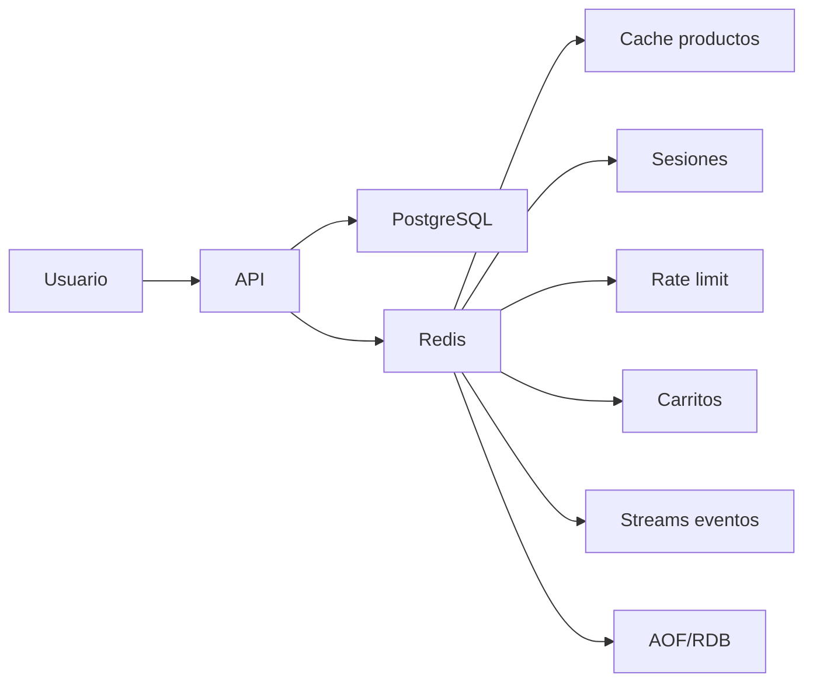

# Proyecto final

El objetivo es construir el diseno Redis de una API de tienda online: cache de productos, sesiones, rate limiting, carrito, eventos ligeros y observabilidad.

## Arquitectura



## Convenciones de claves

```txt
shop:cache:product:{id}
shop:session:{token}
shop:rate:{user_id}:{minute}
shop:cart:{user_id}
shop:events:orders
shop:lock:order:{id}
```

Todas las claves de datos temporales deben tener TTL salvo que el caso de uso lo justifique.

## Cache de productos

Lectura cache-aside:

```txt
1. API busca shop:cache:product:10 en Redis.
2. Si existe, devuelve cache.
3. Si no existe, consulta PostgreSQL.
4. Guarda en Redis con TTL.
5. Devuelve respuesta.
```

Comandos:

```bash
GET shop:cache:product:10
SET shop:cache:product:10 '{"id":10,"name":"Teclado"}' EX 300
```

Invalidacion al actualizar:

```bash
DEL shop:cache:product:10
```

## Sesiones

```bash
SET shop:session:abc123 '{"user_id":1,"role":"user"}' EX 3600
GET shop:session:abc123
EXPIRE shop:session:abc123 3600
```

Renovar TTL solo si la politica de seguridad lo permite.

## Rate limiting

Ventana fija por minuto:

```bash
INCR shop:rate:user-1:2026-06-26T10:30
EXPIRE shop:rate:user-1:2026-06-26T10:30 120
```

Version atomica con Lua:

```lua
local current = redis.call("INCR", KEYS[1])
if current == 1 then
  redis.call("EXPIRE", KEYS[1], ARGV[1])
end
return current
```

La API rechaza si el valor supera el limite.

## Carrito

Usa hash:

```bash
HSET shop:cart:user-1 product:10 2
HINCRBY shop:cart:user-1 product:10 1
HGETALL shop:cart:user-1
EXPIRE shop:cart:user-1 604800
```

El carrito no debe ser la unica fuente para pedidos confirmados. Al comprar, persiste el pedido en PostgreSQL.

## Locks para pedidos

```bash
SET shop:lock:order:100 worker-1 NX PX 30000
```

Liberacion segura con Lua:

```lua
if redis.call("GET", KEYS[1]) == ARGV[1] then
  return redis.call("DEL", KEYS[1])
else
  return 0
end
```

## Eventos con Streams

Crear evento:

```bash
XADD shop:events:orders * type created order_id 100 user_id 1
```

Crear grupo:

```bash
XGROUP CREATE shop:events:orders email-workers $ MKSTREAM
```

Consumir:

```bash
XREADGROUP GROUP email-workers worker-1 COUNT 10 STREAMS shop:events:orders >
```

Confirmar:

```bash
XACK shop:events:orders email-workers 1690000000000-0
```

## Configuracion recomendada

```conf
maxmemory 2gb
maxmemory-policy allkeys-lru
appendonly yes
appendfsync everysec
protected-mode yes
```

## Observabilidad

Comandos de control:

```bash
INFO memory
INFO stats
INFO persistence
INFO replication
SLOWLOG GET 20
LATENCY DOCTOR
```

Metricas esperadas:

- Hit rate de cache.
- Evictions.
- Memoria usada.
- Latencia p95/p99.
- Stream pending entries.
- Errores de persistencia.

## Pruebas funcionales

Checklist:

- Producto inexistente genera miss y luego hit.
- Actualizacion de producto invalida cache.
- Sesion expira.
- Rate limit bloquea exceso de peticiones.
- Carrito incrementa cantidades correctamente.
- Stream conserva eventos pendientes hasta `XACK`.
- Lock no puede liberarse por un owner distinto.

## Riesgos

- Cache stale por invalidacion incompleta.
- Rate limit no atomico.
- Carritos sin TTL.
- Streams sin limpieza.
- Redis expuesto a red publica.
- Sin backups si Redis guarda datos importantes.

## Resultado esperado

Al terminar, tienes un diseno Redis realista para una API:

- Rapido para lecturas repetidas.
- Seguro para sesiones.
- Controlado para abuso.
- Observable.
- Con persistencia y limites definidos.
- Sin convertir Redis en sustituto accidental de la base principal.

