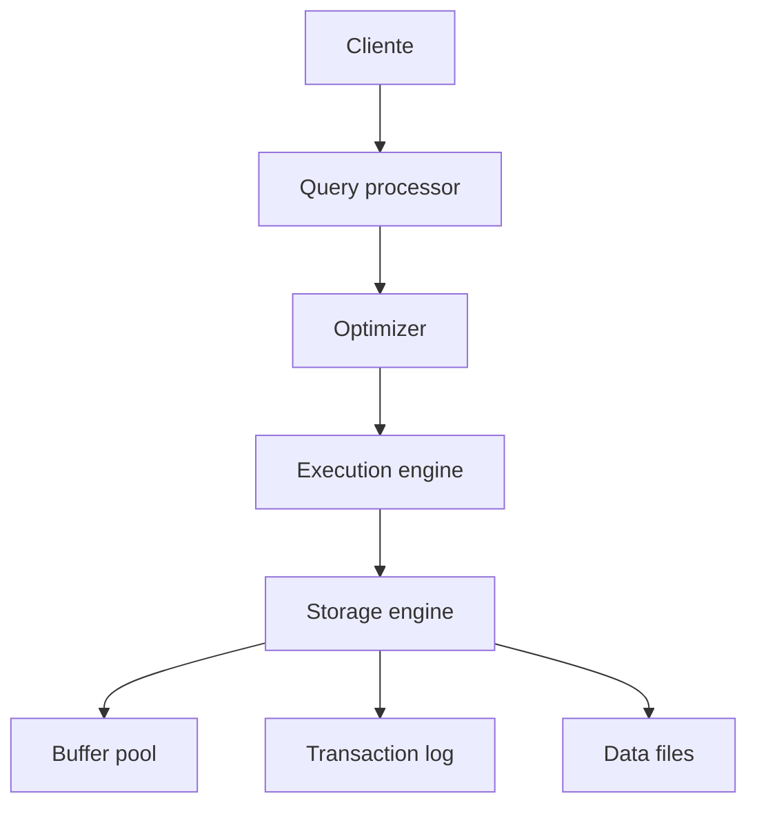

# Arquitectura interna

SQL Server combina motor relacional, optimizador, motor de almacenamiento, buffer pool, transaction log y mecanismos de concurrencia.

## Arquitectura conceptual



## Query processor

Recibe T-SQL, valida sintaxis, resuelve objetos y genera un plan de ejecucion.

## Optimizer

El optimizador elige un plan usando estadisticas, indices y coste estimado.

```sql
SET SHOWPLAN_TEXT ON;
GO
SELECT * FROM dbo.Pedidos WHERE ClienteId = 10;
GO
SET SHOWPLAN_TEXT OFF;
```

## Storage engine

Gestiona paginas, extents, indices, bloqueos, logs y lecturas/escrituras.

## Buffer pool

Cachea paginas de datos e indices en memoria. Muchas consultas rapidas lo son porque leen desde memoria y no desde disco.

## Transaction log

Todo cambio transaccional se registra en el log antes de considerarse durable.

Esto permite:

- Rollback.
- Recuperacion ante fallo.
- Backups de log.
- Alta disponibilidad.

## Estadisticas

SQL Server usa estadisticas para estimar cardinalidad.

```sql
UPDATE STATISTICS dbo.Pedidos;
```

Estadisticas malas pueden producir planes malos.

## Buenas practicas

- Aprende a leer planes de ejecucion.
- Mantén estadisticas e indices.
- Dimensiona memoria para buffer pool.
- No ignores transaction log.
- Evita hints si no entiendes el problema real.
