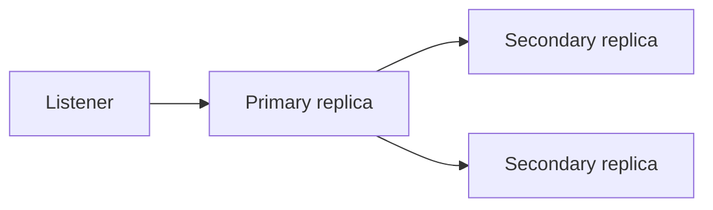

# Alta disponibilidad y replicacion

SQL Server ofrece varias estrategias para disponibilidad, recuperacion y escalado de lectura.

## Opciones principales

- Always On Availability Groups.
- Failover Cluster Instances.
- Log shipping.
- Replicacion transaccional.
- Azure SQL con HA gestionada.

## Always On Availability Groups

Permite failover y replicas secundarias.

## Log shipping

Consiste en enviar backups de log a otro servidor y restaurarlos periodicamente.

Es mas simple que Always On, pero con mayor RPO/RTO.

## Replicacion

Puede distribuir datos a otros servidores para lectura o integracion.

No reemplaza backups.

## Backups y HA

Alta disponibilidad no es backup. Si borras datos por error, el cambio puede replicarse.

Necesitas:

- Backups.
- Pruebas de restore.
- RPO/RTO definidos.

## Buenas practicas

- Define RPO y RTO.
- Prueba failover.
- Prueba restore.
- Monitoriza replicas.
- Documenta roles y procedimientos.
