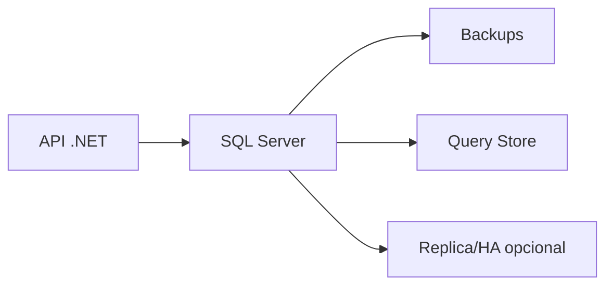

# Proyecto final

El objetivo es construir una base SQL Server para gestion de pedidos: modelo, T-SQL, indices, transacciones, backups, seguridad y diagnostico.

## Arquitectura



## Modelo

```sql
CREATE TABLE dbo.Clientes (
  Id INT IDENTITY(1,1) PRIMARY KEY,
  Email NVARCHAR(255) NOT NULL UNIQUE,
  Nombre NVARCHAR(150) NOT NULL
);

CREATE TABLE dbo.Pedidos (
  Id INT IDENTITY(1,1) PRIMARY KEY,
  ClienteId INT NOT NULL,
  Estado NVARCHAR(30) NOT NULL,
  CreadoEn DATETIME2 NOT NULL DEFAULT SYSUTCDATETIME(),
  CONSTRAINT FK_Pedidos_Clientes FOREIGN KEY (ClienteId) REFERENCES dbo.Clientes(Id)
);
```

## Indices

```sql
CREATE INDEX IX_Pedidos_Cliente_Fecha
ON dbo.Pedidos (ClienteId, CreadoEn DESC);
```

## Transaccion

```sql
BEGIN TRANSACTION;

INSERT INTO dbo.Pedidos (ClienteId, Estado)
VALUES (1, 'confirmado');

COMMIT;
```

## Backup

```sql
BACKUP DATABASE Tienda TO DISK = 'C:\backups\tienda.bak';
```

## Entregable

- Modelo con constraints.
- Indices justificados.
- Procedimiento almacenado para crear pedido.
- Query Store activado.
- Backup y restore probado.
- Usuario de aplicacion con permisos minimos.
- Checklist de rendimiento.
