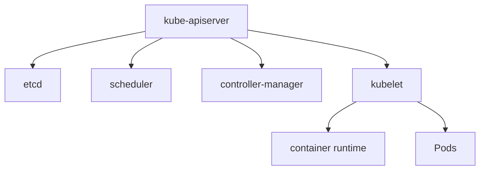

# Arquitectura interna del cluster

Un cluster Kubernetes tiene un plano de control y nodos de trabajo.

## Componentes

## API Server

Es la puerta de entrada. `kubectl`, controllers y componentes hablan con el API Server.

## etcd

Base de datos clave-valor que guarda estado del cluster.

Debe tener backups y alta disponibilidad en produccion.

## Scheduler

Decide en que nodo ejecutar Pods pendientes.

Considera recursos, afinidad, taints, tolerations y restricciones.

## Controllers

Reconciliacion: comparan estado deseado con estado real y actuan.

## Kubelet

Agente en cada nodo. Ejecuta Pods y reporta estado.

## Buenas practicas

- Protege etcd.
- Monitoriza API Server.
- Entiende reconciliacion.
- No edites recursos generados sin saber su owner.
- Haz backups de etcd o usa servicio gestionado.

