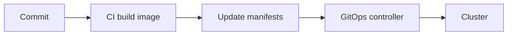

# GitOps y CI/CD

En Kubernetes, el estado deseado debe estar versionado. GitOps usa Git como fuente de verdad y un reconciliador aplica cambios.

## Flujo



## Herramientas

- Argo CD.
- Flux.
- Helm.
- Kustomize.

## CI

Pipeline:

```txt
test -> build image -> scan -> push image -> update manifests
```

## CD

El controlador detecta cambios y sincroniza cluster.

## Buenas practicas

- Imagenes con tag inmutable.
- Manifiestos por entorno.
- Revisar cambios por PR.
- Separar secretos.
- Rollback por Git revert.
- Alertar drift entre Git y cluster.

