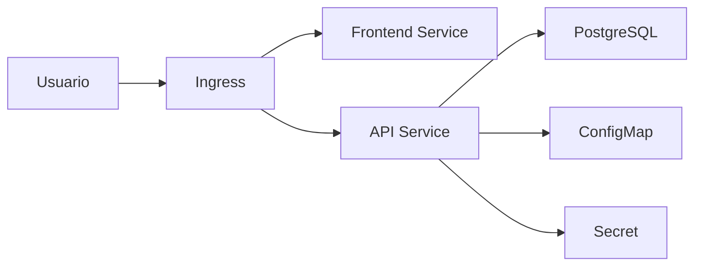

# Proyecto final

El objetivo es desplegar una aplicacion web con API, PostgreSQL, Ingress, ConfigMaps, Secrets, probes, recursos, HPA y Helm.

## Arquitectura



## Recursos

- Namespace `shop`.
- Deployment frontend.
- Deployment API.
- StatefulSet o servicio gestionado para PostgreSQL.
- Services internos.
- Ingress TLS.
- ConfigMap.
- Secret.
- HPA para API.

## Deployment API

Debe incluir:

- Readiness probe.
- Liveness probe.
- Requests/limits.
- Variables desde ConfigMap/Secret.
- Imagen versionada.

## Helm

Estructura:

```txt
chart/
  Chart.yaml
  values.yaml
  templates/
    deployment.yaml
    service.yaml
    ingress.yaml
```

## CI/CD

```txt
test -> build image -> push -> helm upgrade
```

## Validacion

```bash
kubectl get pods -n shop
kubectl rollout status deployment/api -n shop
kubectl logs deployment/api -n shop
```

## Entregable

- Manifiestos o chart Helm.
- Probes configuradas.
- Recursos definidos.
- Ingress con TLS.
- Config y secretos separados.
- HPA.
- Runbook de rollback.
- README de despliegue.

