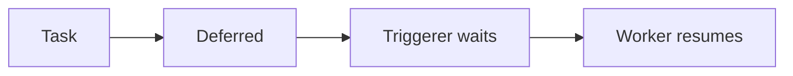

# Sensors y deferrable operators

Los sensors esperan a que ocurra algo: archivo disponible, particion creada, job terminado o API lista. Mal usados, consumen workers innecesariamente.

## Sensor basico

```python
from airflow.sensors.filesystem import FileSensor

wait_file = FileSensor(
    task_id="wait_file",
    filepath="/data/sales.csv",
    poke_interval=60,
    timeout=3600,
)
```

## Modo poke y reschedule

- `poke`: ocupa worker mientras espera.
- `reschedule`: libera worker entre comprobaciones.

Para esperas largas, evita `poke`.

## Deferrable operators

Los deferrable operators delegan espera a un triggerer y liberan workers.

Son mejores para esperas largas y muchas tareas bloqueadas.



## ExternalTaskSensor

Espera a otro DAG o task.

Usalo con cuidado: demasiadas dependencias cruzadas pueden crear acoplamiento dificil de entender.

## Datasets como alternativa

Si la dependencia es "cuando se produzca este dataset", los datasets pueden ser mas expresivos que sensors.

## Timeouts

Todo sensor debe tener timeout.

```python
timeout=60 * 60
```

Sin timeout, una espera rota puede quedarse viva demasiado tiempo.

## Buenas practicas

- Usa deferrable operators para esperas largas.
- Define timeouts.
- Evita sensors que consultan demasiado agresivamente.
- Prefiere datasets para dependencias de datos.
- Documenta dependencias entre DAGs.
- No uses sensors para tapar falta de contratos entre sistemas.
