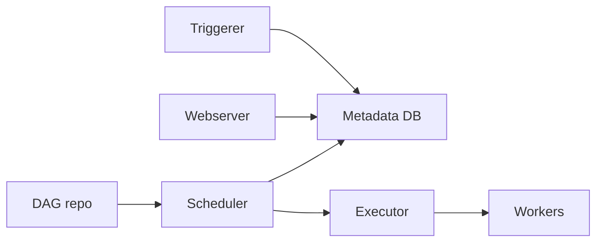

# Despliegue

Desplegar Airflow implica publicar DAGs, configurar conexiones, asegurar la metadata database y operar scheduler, webserver, workers y triggerer.

## Opciones

- Docker Compose para desarrollo.
- Kubernetes con Helm.
- Servicio gestionado como MWAA, Cloud Composer o Astronomer.
- Instalacion propia en VMs.

## Componentes

## Metadata database

No uses SQLite en produccion. Usa PostgreSQL o MySQL gestionado.

## Executors

- SequentialExecutor: local y simple.
- LocalExecutor: paralelo en una maquina.
- CeleryExecutor: workers distribuidos.
- KubernetesExecutor: tareas como pods.

## DAG delivery

Opciones:

- Git sync.
- Imagen Docker con DAGs incluidos.
- Volumen compartido.
- Deploy por artefacto.

## Configuracion

Variables, conexiones y secretos deben gestionarse fuera del codigo.

En produccion, usa secret backend.

## Migraciones de Airflow

Al actualizar Airflow:

- Lee notas de version.
- Prueba en staging.
- Haz backup de metadata DB.
- Ejecuta migraciones controladas.

## Buenas practicas

- No editar DAGs manualmente en servidores.
- Versionar DAGs en Git.
- Usar metadata DB robusta.
- Separar dev/staging/prod.
- Proteger UI con autenticacion.
- Monitorizar scheduler y workers.
