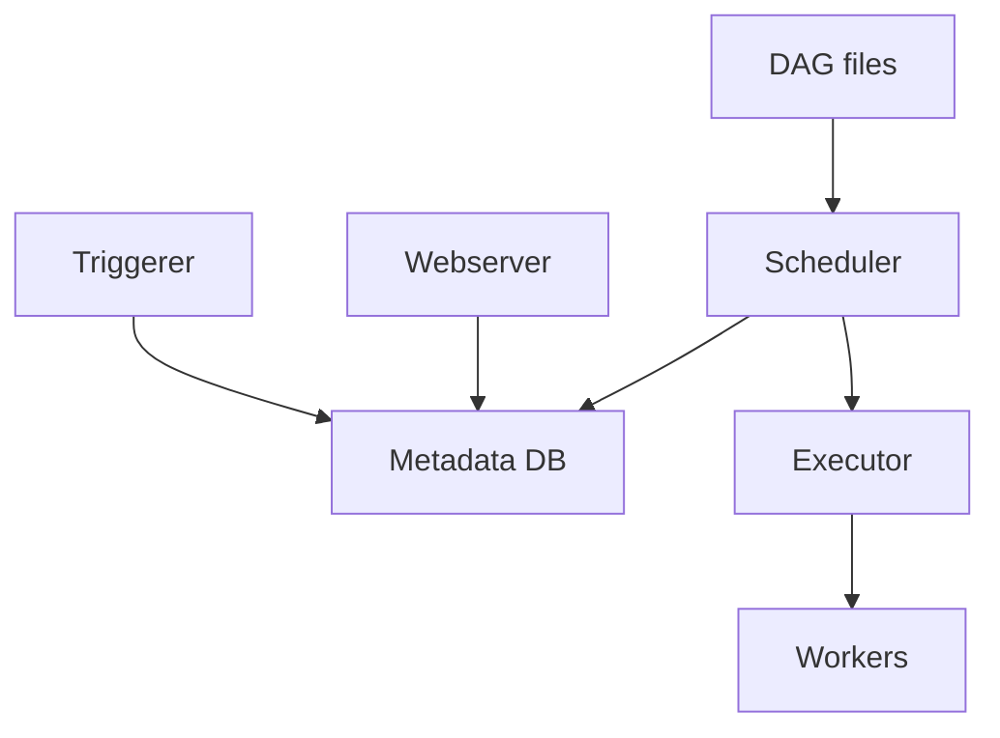

# Arquitectura interna

Airflow coordina ejecuciones mediante scheduler, metadata database, executor, workers, webserver y triggerer.

## Componentes

## Scheduler

El scheduler:

- Parse DAG files.
- Crea DAG runs.
- Decide tasks listas.
- Envia tasks al executor.

Si el scheduler va lento, todo Airflow sufre.

## Metadata DB

Guarda:

- DAG runs.
- Task instances.
- XComs.
- Variables.
- Connections.
- Usuarios y permisos.

Debe ser una base robusta en produccion.

## Executor

Define donde se ejecutan tasks:

- Local.
- Celery.
- Kubernetes.

## Worker

Ejecuta tareas. Debe tener dependencias necesarias, acceso a redes externas y configuracion correcta.

## Triggerer

Gestiona tareas deferred. Es clave si usas deferrable operators.

## Parse time

El archivo DAG se importa muchas veces. Por eso no debes hacer consultas o trabajos pesados al nivel superior del modulo.

## Buenas practicas

- DAGs rapidos de parsear.
- Scheduler monitorizado.
- Metadata DB gestionada con backups.
- Workers reproducibles.
- Triggerer activo si usas deferrable operators.
- Dependencias Python controladas.

