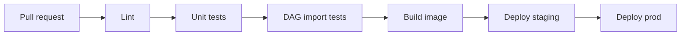

# CI/CD para DAGs

Los DAGs deben pasar por revision, tests y despliegue controlado igual que cualquier codigo de produccion.

## Pipeline



## Checks minimos

- Formato.
- Lint.
- Tests de funciones.
- Importacion de DAGs.
- Validacion de dependencias.
- Scan de secretos.

## Test de importacion

```python
def test_no_import_errors():
    dag_bag = DagBag(dag_folder="dags", include_examples=False)
    assert dag_bag.import_errors == {}
```

## Despliegue

Opciones:

- Sincronizar DAGs desde Git.
- Construir imagen con DAGs.
- Publicar paquete versionado.

La opcion de imagen suele dar mas reproducibilidad.

## Versionado

Etiqueta imagenes con:

```txt
git sha
version semantica si aplica
fecha de build
```

## Buenas practicas

- PR obligatoria para DAGs criticos.
- Tests de importacion en CI.
- Staging antes de prod.
- Rollback definido.
- No desplegar secretos con DAGs.
- Revisar cambios de schedule, catchup y retencion con cuidado.

