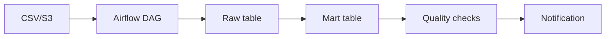

# Proyecto final

El objetivo es construir un pipeline Airflow de ventas diarias con extraccion, validacion, carga, transformacion, calidad, alertas y despliegue.

## Arquitectura



## DAG

Tareas:

1. Esperar archivo.
2. Validar esquema.
3. Cargar raw.
4. Transformar mart.
5. Ejecutar checks.
6. Notificar resultado.

## Estructura

```txt
dags/
  daily_sales.py
include/
  sql/
    load_raw_sales.sql
    build_sales_mart.sql
tests/
  test_dags_import.py
  test_sales_logic.py
```

## Ejemplo de DAG

```python
@dag(
    dag_id="daily_sales",
    schedule="@daily",
    start_date=datetime(2026, 1, 1),
    catchup=False,
    tags=["sales", "warehouse"],
)
def daily_sales():
    wait = wait_for_file()
    validate = validate_schema()
    raw = load_raw()
    mart = build_mart()
    quality = run_quality_checks()
    notify = notify_result()

    wait >> validate >> raw >> mart >> quality >> notify

daily_sales()
```

## Idempotencia

Cada ejecucion procesa una fecha:

```txt
{{ ds }}
```

La carga raw debe reemplazar o marcar la particion de esa fecha para evitar duplicados.

## Validaciones

- Columnas obligatorias.
- Tipos correctos.
- Conteo mayor que cero.
- Sin IDs duplicados.
- Totales no negativos.

## Observabilidad

Alertas:

- Archivo no llega.
- Validacion falla.
- Carga tarda demasiado.
- Checks fallan.
- DAG no termina antes del SLA.

## CI

La pipeline debe ejecutar:

```txt
ruff/flake8 -> pytest -> DAG import tests -> build image
```

## Entregable

El proyecto final debe incluir:

- DAG legible.
- Tests de importacion.
- Funciones de validacion testeadas.
- SQL separado del DAG.
- Variables/conexiones documentadas.
- Pools si hay sistemas limitados.
- Logs y alertas con contexto.
- Guia de backfill.

