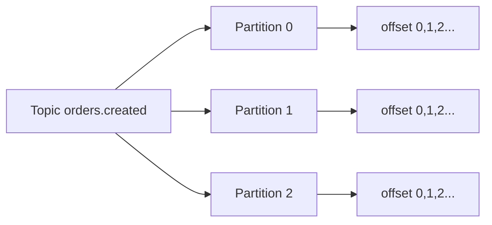
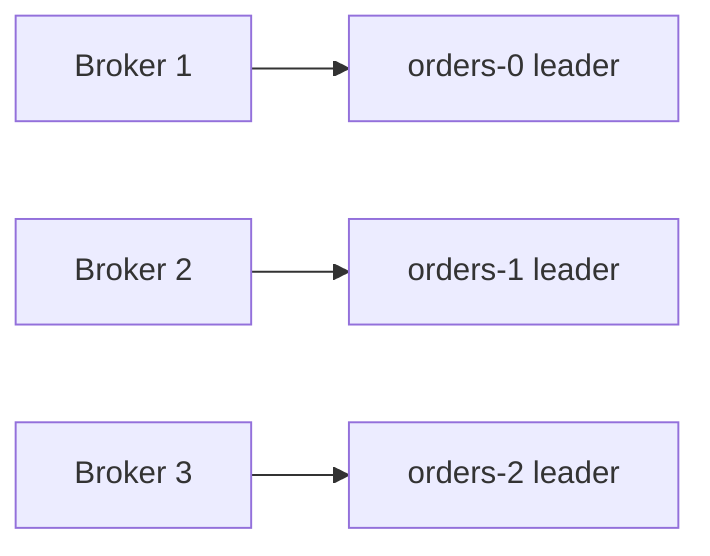
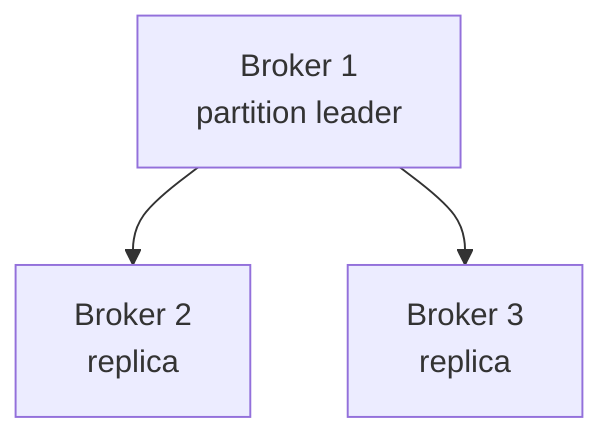

# Topics, partitions y brokers

Kafka organiza los eventos en topics. Cada topic se divide en partitions y esas partitions viven repartidas entre brokers.

## Topic

Un topic es una categoria logica de eventos.

Ejemplos:

```txt
orders.created
orders.cancelled
payments.authorized
users.registered
```

Un topic debe representar un flujo de eventos con significado de negocio o tecnico claro.

## Partition

Una partition es un log ordenado e inmutable.



Kafka garantiza orden dentro de una partition, no entre partitions distintas.

## Offset

El offset es la posicion de un evento dentro de una partition.

```txt
topic: orders.created
partition: 2
offset: 1538
```

El offset no es global. Solo tiene sentido dentro de topic + partition.

## Broker

Un broker es un servidor Kafka. Un cluster tiene varios brokers para repartir carga y replicas.



## Leader y replicas

Cada partition tiene un leader. Productores y consumidores hablan con el leader. Las replicas copian los datos.



Si el leader falla, Kafka puede elegir una replica sincronizada como nuevo leader.

## Replication factor

`replication.factor=3` significa que cada partition tiene tres copias.

Ventajas:

- Tolerancia a fallos.
- Mantenimiento sin perder disponibilidad.
- Menor riesgo de perdida de datos.

Costes:

- Mas disco.
- Mas red.
- Mas coordinacion.

## Partitions y paralelismo

El numero de partitions limita el paralelismo de consumo dentro de un consumer group.

Si un topic tiene 6 partitions, un consumer group puede tener hasta 6 consumidores trabajando en paralelo de forma efectiva.

## Elegir numero de partitions

Considera:

- Throughput esperado.
- Numero de consumidores paralelos.
- Retencion y tamano de eventos.
- Necesidad de orden por clave.
- Coste operativo.

No crees cientos de partitions sin motivo. Las partitions tambien tienen coste.

## Clave de particion

El producer puede enviar una key. Kafka usa esa key para decidir partition.

Ejemplo:

```txt
key = order_id
```

Todos los eventos del mismo pedido iran a la misma partition, manteniendo orden para ese pedido.

## Buenas practicas

- Usa nombres de topics claros y estables.
- Define keys pensando en orden y distribucion.
- Usa replication factor 3 en produccion cuando sea posible.
- Evita topics con partitions insuficientes para crecer.
- No dependas de orden global.
