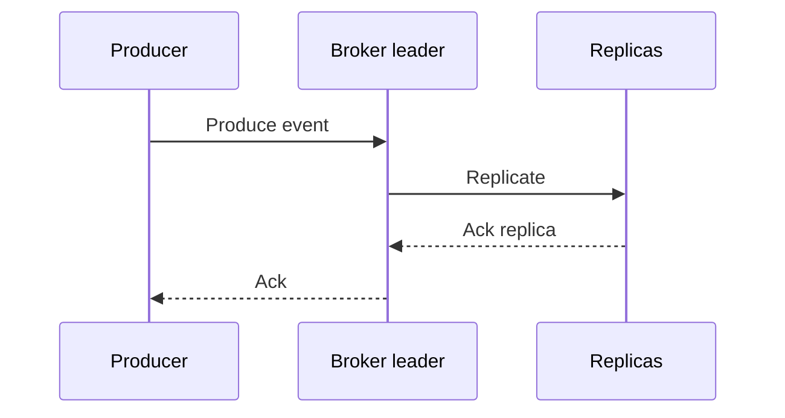
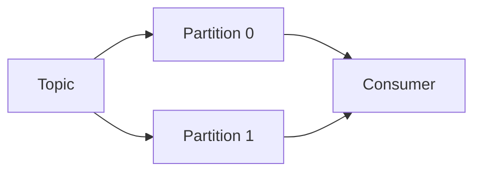

# Producers y consumers

Los producers publican eventos y los consumers los leen. La calidad de un sistema Kafka depende mucho de como configuras ambos.

## Producer

Un producer envia registros a un topic.

Registro:

```txt
topic + key + value + headers + timestamp
```

Ejemplo JSON:

```json
{
  "event_id": "evt_001",
  "event_type": "order_created",
  "order_id": "ord_123",
  "occurred_at": "2026-06-26T10:00:00Z"
}
```

## Flujo de escritura



## Acks

Configuracion importante:

```txt
acks=0
acks=1
acks=all
```

- `acks=0`: maxima velocidad, minima seguridad.
- `acks=1`: confirma cuando leader escribe.
- `acks=all`: confirma cuando replicas sincronizadas escriben.

En produccion critica, usa `acks=all`.

## Idempotent producer

Evita duplicados causados por reintentos del producer.

```txt
enable.idempotence=true
```

Es una configuracion recomendada para productores importantes.

## Batching

Kafka es eficiente cuando agrupa eventos.

Parametros:

- `batch.size`
- `linger.ms`
- `compression.type`

Mas batching puede mejorar throughput, pero anade latencia.

## Consumer

Un consumer lee eventos de una o varias partitions.



## Poll loop

Un consumer suele seguir este ciclo:

```txt
poll -> procesar -> guardar resultado -> commit offset
```

El orden exacto importa. Si haces commit antes de procesar, puedes perder eventos ante fallo.

## Commit de offsets

Opciones:

- Automatico: mas simple, menos control.
- Manual: mas seguro para procesos importantes.

Patron habitual:

```txt
1. Leer eventos.
2. Procesar.
3. Persistir efectos.
4. Hacer commit del offset.
```

## Idempotencia del consumidor

Kafka puede entregar un evento mas de una vez en ciertos escenarios. El consumidor debe tolerarlo.

Tecnicas:

- Guardar `event_id` procesados.
- Usar upserts.
- Diseñar operaciones idempotentes.
- Transacciones en la base destino cuando aplique.

## Headers

Los headers permiten metadata sin tocar payload:

```txt
correlation_id
schema_version
source_service
trace_id
```

Son utiles para observabilidad y trazabilidad.

## Buenas practicas

- Usa keys estables.
- Habilita idempotencia en productores criticos.
- Usa compresion para eventos grandes o mucho volumen.
- Haz consumidores idempotentes.
- Controla el commit de offsets en procesos importantes.
- Propaga `trace_id` o `correlation_id`.
