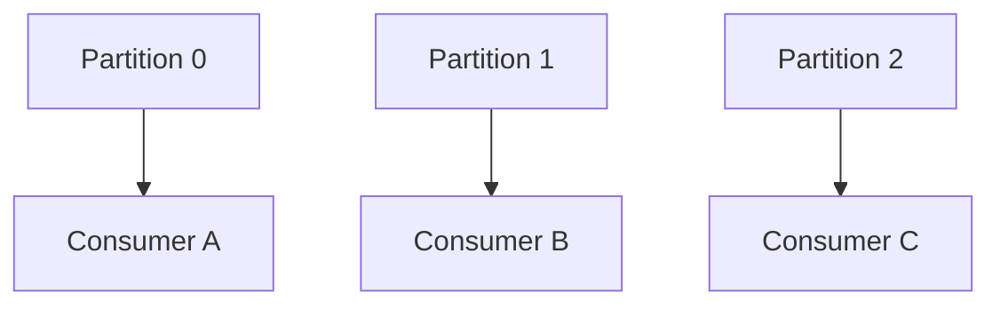
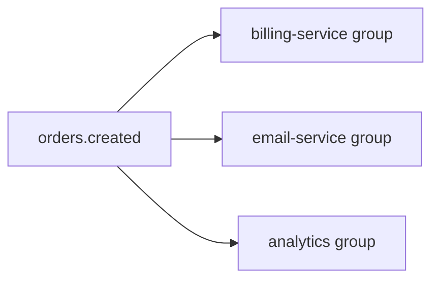

# Consumer groups y offsets

Consumer groups permiten escalar consumo y repartir partitions entre instancias. Los offsets indican hasta donde ha leido cada grupo.

## Consumer group

Un consumer group es un conjunto de consumers que colaboran leyendo un topic.



Dentro del mismo group, una partition solo se asigna a un consumer a la vez.

## Varios grupos

Grupos distintos leen de forma independiente.



Cada grupo tiene sus propios offsets.

## Offset commit

Kafka guarda offsets en el topic interno `__consumer_offsets`.

Un commit significa:

```txt
Este grupo ya proceso hasta este offset.
```

## Auto commit

Simple:

```txt
enable.auto.commit=true
```

Riesgo: confirmar offsets antes de que el procesamiento real haya terminado.

## Commit manual

Mas control:

```txt
enable.auto.commit=false
```

Patron:

```txt
poll -> procesar lote -> commit
```

## Rebalance

Un rebalance reasigna partitions cuando:

- Entra un consumer nuevo.
- Sale un consumer.
- Un consumer deja de enviar heartbeats.
- Cambia la lista de topics.

Durante un rebalance puede pausarse temporalmente el consumo.

## Lag

Lag es la diferencia entre el ultimo offset disponible y el offset confirmado por el grupo.

```txt
lag = log_end_offset - committed_offset
```

Mucho lag indica que consumidores no alcanzan el ritmo de produccion.

## Reprocesamiento

Puedes mover offsets:

```bash
kafka-consumer-groups --bootstrap-server localhost:9092 \
  --group analytics \
  --topic orders.created \
  --reset-offsets --to-earliest --execute
```

Hazlo con cuidado. Reprocesar puede duplicar efectos si los consumidores no son idempotentes.

## Offset earliest y latest

Configuracion:

```txt
auto.offset.reset=earliest
auto.offset.reset=latest
```

Solo se usa si no hay offset previo valido para el grupo.

## Buenas practicas

- Monitoriza lag por grupo.
- Usa commit manual en procesos criticos.
- Disena consumidores idempotentes.
- Evita procesamientos demasiado lentos dentro del poll loop.
- Ajusta numero de partitions y consumers segun throughput.
- Documenta como reprocesar de forma segura.
