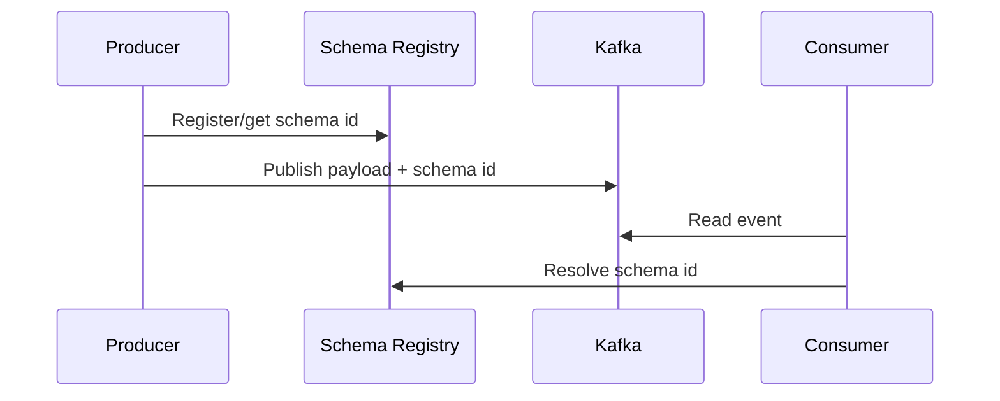

# Serializacion y schemas

Kafka transporta bytes. El significado de esos bytes depende de la serializacion y del contrato entre productores y consumidores.

## Formatos comunes

- JSON: legible y simple.
- Avro: compacto, schema explicito, muy usado con Schema Registry.
- Protobuf: compacto, multiplataforma.
- String: util para pruebas o mensajes simples.

## JSON

Ejemplo:

```json
{
  "event_id": "evt_001",
  "event_type": "order_created",
  "order_id": "ord_123",
  "amount": 89.9
}
```

Ventajas:

- Facil de depurar.
- Compatible con muchas herramientas.

Riesgos:

- Sin contrato fuerte por defecto.
- Cambios pueden romper consumidores.
- Mas pesado que formatos binarios.

## Avro

Schema conceptual:

```json
{
  "type": "record",
  "name": "OrderCreated",
  "fields": [
    { "name": "event_id", "type": "string" },
    { "name": "order_id", "type": "string" },
    { "name": "amount", "type": "double" }
  ]
}
```

Avro funciona especialmente bien con Schema Registry.

## Schema Registry

Un Schema Registry guarda versiones de schemas y valida compatibilidad.



## Compatibilidad

Tipos comunes:

- Backward: consumidores nuevos leen datos antiguos.
- Forward: consumidores antiguos leen datos nuevos.
- Full: ambas direcciones.

Regla practica: añadir campos opcionales con default suele ser seguro. Renombrar o borrar campos suele romper.

## Versionado

Incluye metadata:

```json
{
  "event_id": "evt_001",
  "schema_version": 2,
  "occurred_at": "2026-06-26T10:00:00Z",
  "payload": {}
}
```

Si usas Schema Registry, el schema id puede cubrir parte de esta necesidad, pero la version semantica sigue ayudando.

## Headers de contrato

Headers utiles:

```txt
schema_id
schema_version
content_type
correlation_id
source_service
```

## Dead letter topic

Eventos que no se pueden deserializar o validar pueden enviarse a un DLT:

```txt
orders.created.dlt
```

Incluye causa de error, consumer, fecha y payload original si es seguro.

## Buenas practicas

- Define schemas para eventos compartidos.
- Valida compatibilidad en CI.
- No rompas consumidores silenciosamente.
- Usa DLT para errores no recuperables.
- Versiona eventos de negocio importantes.
- Documenta ownership de cada topic y schema.
