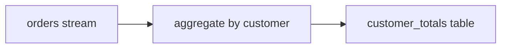
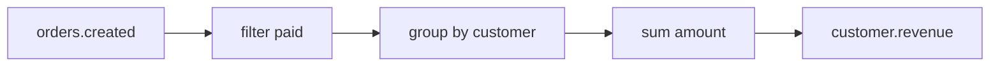
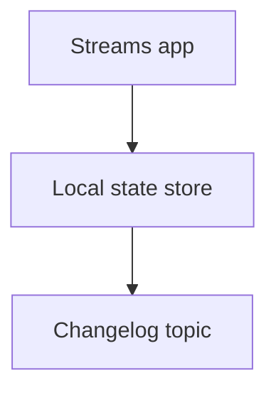

# Kafka Streams

Kafka Streams es una libreria para construir aplicaciones de procesamiento sobre Kafka. No es un cluster separado: tu aplicacion ejecuta la logica y Kafka almacena entradas, salidas y estado.

## Cuándo usar Kafka Streams

Usalo cuando necesitas:

- Transformar eventos.
- Filtrar flujos.
- Agregar por ventanas.
- Enriquecer eventos.
- Mantener estado local.
- Unir streams y tablas.

No lo uses si solo necesitas copiar datos de un topic a otro sin logica.

## Stream y table

Un stream es una secuencia de eventos.

Una table representa el estado actual derivado de eventos.



## Topologia

Una topologia describe pasos de procesamiento.

```txt
source -> filter -> map -> aggregate -> sink
```

Ejemplo conceptual:



## Estado local

Kafka Streams puede mantener state stores locales. Kafka usa changelog topics para recuperar ese estado si la instancia cae.



## Ventanas

Ejemplo de necesidad:

```txt
Calcular pedidos por cliente cada 5 minutos.
```

Tipos de ventanas:

- Tumbling.
- Hopping.
- Session.

## Reprocesamiento

Como Kafka conserva eventos, puedes reiniciar una aplicacion y reprocesar si la retencion lo permite.

Esto exige:

- Eventos deterministas.
- Consumidores idempotentes en salidas externas.
- Versionado claro de la logica.

## Exactly-once processing

Kafka Streams puede usar procesamiento exactly-once dentro de Kafka con transacciones.

Configuracion conceptual:

```txt
processing.guarantee=exactly_once_v2
```

Esto no garantiza exactamente una vez si llamas a sistemas externos fuera de la transaccion Kafka.

## Casos de uso

- Agregados en tiempo casi real.
- Materialized views.
- Enriquecimiento de eventos.
- Deteccion de patrones.
- Normalizacion de flujos.

## Buenas practicas

- Mantén topologias comprensibles.
- Versiona cambios incompatibles.
- Monitoriza lag y estado local.
- Usa changelog topics con retencion adecuada.
- Prueba reprocesamiento.
- No mezcles demasiada logica de negocio opaca en un solo stream.
