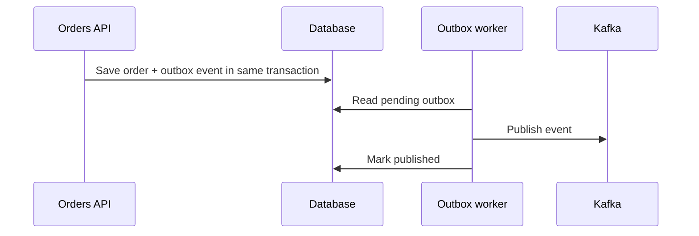

# Patrones de eventos

Kafka funciona mejor cuando los eventos se disenan como contratos de negocio, no como dumps accidentales de tablas.

## Evento de negocio

Un evento de negocio representa algo que ya ocurrio.

Ejemplos:

```txt
OrderCreated
PaymentAuthorized
UserRegistered
ShipmentDelivered
```

Usa pasado: el evento no pide hacer algo, informa de algo ocurrido.

## Comando vs evento

Comando:

```txt
CreateOrder
```

Evento:

```txt
OrderCreated
```

Los comandos expresan intencion. Los eventos expresan hechos.

## Event envelope

Estructura recomendada:

```json
{
  "event_id": "evt_001",
  "event_type": "OrderCreated",
  "occurred_at": "2026-06-26T10:00:00Z",
  "producer": "orders-service",
  "schema_version": 1,
  "payload": {
    "order_id": "ord_123",
    "customer_id": "cus_456"
  }
}
```

## Outbox pattern

Problema: guardar en base de datos y publicar en Kafka no es atomico si son dos sistemas separados.

Solucion:



## Idempotent consumer

Un consumidor puede recibir duplicados. Usa `event_id`:

```txt
Si event_id ya fue procesado, ignorar.
Si no, procesar y guardar event_id.
```

## Dead letter topic

Usa DLT para eventos que no pueden procesarse:

```txt
orders.created.dlt
```

Incluye:

- Error.
- Consumer.
- Fecha.
- Intentos.
- Payload o referencia segura.

## Retry topics

Para errores temporales:

```txt
orders.created.retry.1m
orders.created.retry.10m
orders.created.dlt
```

Evita reintentar infinitamente en el topic principal.

## Event-carried state transfer

El evento contiene suficiente informacion para que consumidores no tengan que llamar al productor.

Ventaja:

- Menos acoplamiento.

Coste:

- Eventos mas grandes.
- Versionado mas importante.

## CDC

Change Data Capture publica cambios de base de datos.

Util para integrar sistemas, pero no siempre equivale a eventos de negocio. Un cambio de fila no explica necesariamente la intencion de negocio.

## Buenas practicas

- Nombra eventos en pasado.
- Incluye `event_id`, `occurred_at`, `producer` y version.
- Disena consumidores idempotentes.
- Usa outbox cuando necesitas consistencia entre DB y Kafka.
- Separa retries de errores definitivos.
- No conviertas Kafka en llamada RPC disfrazada.
