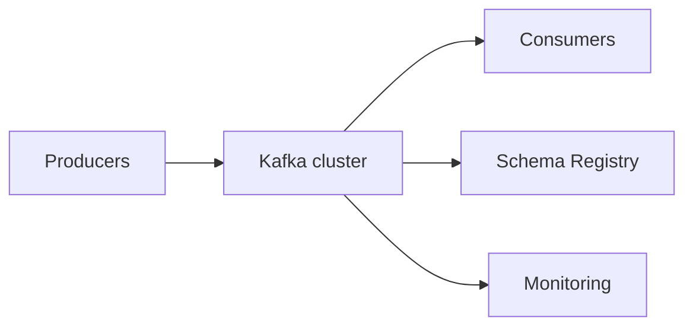

# Kafka en produccion

Kafka en produccion exige decisiones sobre capacidad, seguridad, retencion, esquemas, despliegues y gobierno de topics.

## Checklist inicial

- Numero de brokers.
- Replication factor.
- Partitions por topic.
- Retencion.
- Seguridad.
- Backups de configuracion.
- Observabilidad.
- Politica de schemas.
- Owners de topics.

## Topologia base



## Capacidad

Dimensiona:

- MB/s de entrada.
- MB/s de salida.
- Numero de mensajes.
- Tamaño medio de evento.
- Retencion.
- Replication factor.
- Crecimiento esperado.

Formula conceptual de disco:

```txt
disco = entrada_diaria * dias_retencion * replication_factor * margen
```

## Configuracion critica

Para eventos importantes:

```txt
replication.factor=3
min.insync.replicas=2
acks=all
enable.idempotence=true
```

## Topics como codigo

Gestiona topics con IaC o scripts revisados:

```yaml
name: orders.created
partitions: 12
replicationFactor: 3
config:
  retention.ms: 604800000
```

Evita crear topics manuales sin ownership.

## Despliegues de consumidores

Cuida:

- Shutdown graceful.
- Commit final controlado.
- Pausar consumo si downstream cae.
- Reintentos con backoff.
- DLT para errores no recuperables.

## Retencion y reprocesamiento

Si analytics necesita reprocesar 7 dias, la retencion debe cubrirlo.

No bajes retencion sin hablar con consumidores.

## Seguridad

Minimos:

- TLS.
- Autenticacion.
- ACLs por servicio.
- Secrets fuera del codigo.
- Auditoria.

## Gobierno

Cada topic deberia tener:

- Owner.
- Descripcion.
- Schema.
- Retencion.
- Criticidad.
- Productores autorizados.
- Consumidores conocidos.

## Buenas practicas

- No mezcles eventos criticos con experimentales sin separacion.
- Usa naming consistente.
- Prueba restauracion de consumidores desde earliest.
- Simula caida de broker en entornos controlados.
- Valida schemas en CI.
- Documenta procedimientos de reprocesamiento.

