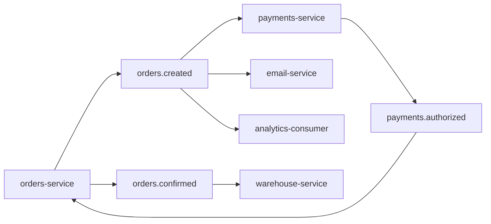
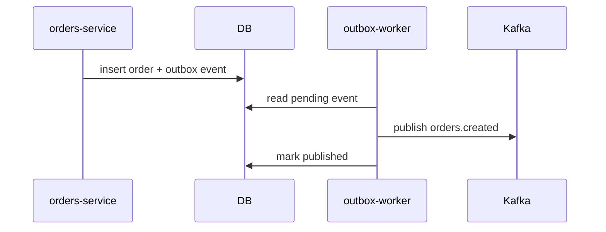

# Proyecto final

El objetivo es disenar una arquitectura de eventos para una tienda online con Kafka: pedidos, pagos, emails, analytics y reprocesamiento.

## Arquitectura



## Topics

| Topic | Key | Retencion | Owner |
| --- | --- | --- | --- |
| `orders.created` | `order_id` | 7 dias | orders |
| `payments.authorized` | `order_id` | 7 dias | payments |
| `orders.confirmed` | `order_id` | 30 dias | orders |
| `orders.dlt` | `event_id` | 14 dias | platform |

## Evento `OrderCreated`

```json
{
  "event_id": "evt_001",
  "event_type": "OrderCreated",
  "occurred_at": "2026-06-26T10:00:00Z",
  "producer": "orders-service",
  "schema_version": 1,
  "payload": {
    "order_id": "ord_123",
    "customer_id": "cus_456",
    "amount": 89.9,
    "currency": "EUR"
  }
}
```

## Key

Usa:

```txt
key = order_id
```

Asi todos los eventos de un pedido mantienen orden dentro de la misma partition.

## Outbox

`orders-service` debe guardar pedido y evento en la misma transaccion de base de datos.



## Consumidores

`payments-service`:

- Lee `orders.created`.
- Autoriza pago.
- Publica `payments.authorized`.
- Debe ser idempotente por `event_id`.

`email-service`:

- Lee `orders.created`.
- Envia email.
- Si falla temporalmente, reintenta.
- Si falla definitivamente, envia a DLT.

`analytics-consumer`:

- Lee eventos.
- Escribe en data warehouse.
- Puede reprocesar desde offsets antiguos.

## Configuracion de topic

```txt
partitions=12
replication.factor=3
min.insync.replicas=2
retention.ms=604800000
```

## Configuracion de producer

```txt
acks=all
enable.idempotence=true
compression.type=zstd
retries=2147483647
```

## Configuracion de consumer

```txt
enable.auto.commit=false
auto.offset.reset=earliest
```

El consumer confirma offset despues de persistir efectos.

## DLT

Evento de DLT:

```json
{
  "original_topic": "orders.created",
  "original_event_id": "evt_001",
  "consumer": "email-service",
  "error": "invalid email",
  "failed_at": "2026-06-26T10:01:00Z"
}
```

## Observabilidad

Alertas:

- Lag alto por consumer group.
- Under replicated partitions.
- DLT creciendo.
- Errores de schema.
- Produce latency alta.
- Disco por encima del umbral.

## Pruebas

Checklist:

- Dos eventos del mismo `order_id` mantienen orden.
- Consumer duplicado no duplica efectos.
- Evento invalido va a DLT.
- Analytics puede reprocesar desde earliest.
- Caida de un broker no pierde eventos con `acks=all`.
- Cambio de schema incompatible falla en CI.

## Resultado esperado

Al terminar, tienes una arquitectura Kafka profesional:

- Topics con ownership.
- Eventos versionados.
- Productores seguros.
- Consumidores idempotentes.
- Outbox para consistencia.
- DLT para errores.
- Observabilidad y reprocesamiento documentados.

