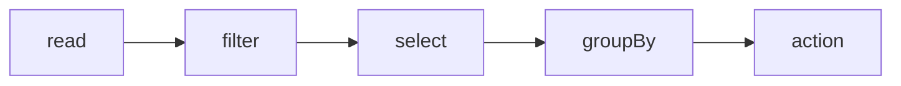

# Transformaciones y acciones

Spark evalua de forma perezosa. Las transformaciones construyen un plan; las acciones disparan ejecucion.

## Transformaciones

```python
filtered = (
    df
    .filter(F.col("amount") > 0)
    .withColumn("amount_eur", F.col("amount") * F.lit(0.92))
    .select("order_id", "amount_eur")
)
```

No se ejecuta hasta que haya una accion.

## Acciones

```python
filtered.show()
filtered.count()
filtered.write.mode("overwrite").parquet("/tmp/orders")
```

## Lazy evaluation



Spark puede optimizar el plan antes de ejecutarlo.

## withColumn

```python
df = df.withColumn("created_date", F.to_date("created_at"))
```

Evita cadenas enormes de `withColumn` si puedes agrupar con `select`.

## Filtros

```python
df.filter((F.col("country") == "ES") & (F.col("amount") > 100))
```

## Acciones peligrosas

Evita:

```python
df.collect()
```

`collect()` trae todo al driver. Usalo solo con resultados pequeños.

## Buenas practicas

- Piensa en planes, no en bucles fila a fila.
- Usa funciones nativas de Spark.
- Minimiza acciones intermedias.
- No uses `collect()` para datos grandes.
- Revisa `explain()` en procesos lentos.
