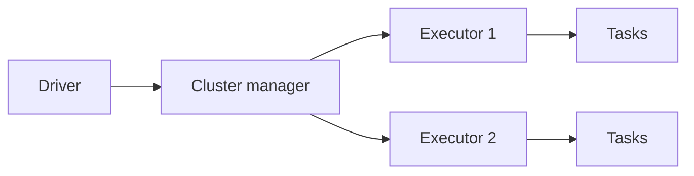

# Arquitectura interna de Spark

Spark distribuye trabajo entre driver y executors. Entender esta arquitectura ayuda a evitar errores de memoria, lentitud y mal uso de `collect()`.

## Componentes

## Driver

El driver crea el plan, coordina jobs y recibe resultados de acciones.

No debe recibir datos enormes con `collect()`.

## Executors

Ejecutan tasks y guardan datos cacheados.

## Jobs, stages y tasks

Una accion crea un job. El job se divide en stages. Cada stage contiene tasks.

Los shuffles separan stages.

## Catalyst y Tungsten

Catalyst optimiza planes logicos. Tungsten optimiza ejecucion fisica y memoria.

## Buenas practicas

- Evita traer datos grandes al driver.
- Revisa stages en Spark UI.
- Entiende que shuffle separa stages.
- Ajusta recursos segun datos, no por intuicion.
- Prefiere DataFrame API y SQL sobre RDDs para analitica.

