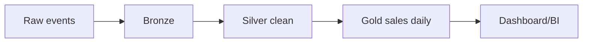

# Proyecto final

El objetivo es construir un pipeline PySpark de ventas: leer eventos, validar schema, transformar, agregar, escribir en Parquet/Delta y optimizar.

## Arquitectura



## Entrada

```json
{
  "order_id": "o1",
  "customer_id": "c1",
  "country": "ES",
  "amount": 120.5,
  "event_time": "2026-06-26T10:00:00Z"
}
```

## Schema

```python
schema = T.StructType([
    T.StructField("order_id", T.StringType(), False),
    T.StructField("customer_id", T.StringType(), False),
    T.StructField("country", T.StringType(), False),
    T.StructField("amount", T.DoubleType(), False),
    T.StructField("event_time", T.TimestampType(), False),
])
```

## Transformacion

```python
silver = (
    raw
    .filter(F.col("amount") >= 0)
    .withColumn("event_date", F.to_date("event_time"))
    .dropDuplicates(["order_id"])
)
```

## Agregado gold

```python
gold = (
    silver
    .groupBy("event_date", "country")
    .agg(
        F.count("*").alias("orders"),
        F.sum("amount").alias("revenue"),
    )
)
```

## Escritura

```python
gold.write.mode("overwrite").partitionBy("event_date").parquet(gold_path)
```

## Tests

- Schema correcto.
- Filtra importes negativos.
- Deduplica por `order_id`.
- Agrega ingresos por fecha y pais.
- No usa `collect()` con datos grandes.

## Entregable

- Pipeline parametrizado por fecha.
- Bronze, silver y gold.
- Schemas explicitos.
- Tests unitarios.
- Escritura particionada.
- `explain()` revisado.
- Documentacion de backfill.

