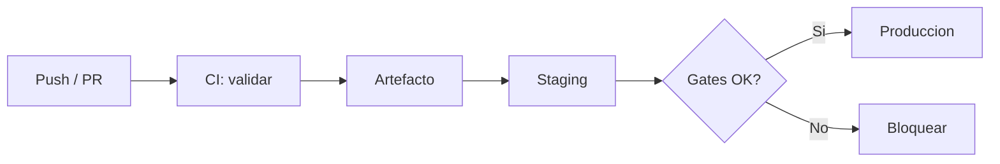

# CI/CD: introduccion y principios

CI/CD (Continuous Integration / Continuous Delivery o Deployment) automatiza como el codigo se integra, valida y despliega. El objetivo es detectar errores pronto, entregar cambios de forma repetible y reducir despliegues manuales arriesgados.

Este manual cubre pipelines, artefactos, estrategias de despliegue y operacion. Los ejemplos se apoyan en herramientas comunes como GitHub Actions, pero los principios aplican a GitLab CI, Jenkins, Azure DevOps o CircleCI.

## Capitulos

1. [Introduccion y principios](01-introduccion-y-principios.md)
2. [Pipelines de build test y deploy](02-pipelines-de-build-test-y-deploy.md)
3. [Versionado y artefactos](03-versionado-y-artefactos.md)
4. [Estrategias de despliegue](04-estrategias-de-despliegue.md)
5. [Calidad seguridad y gates](05-calidad-seguridad-y-gates.md)
6. [Rollback y observabilidad](06-rollback-y-observabilidad.md)
7. [Buenas practicas](07-buenas-practicas.md)

## Continuous Integration (CI)

CI significa integrar cambios pequenos y frecuentes en una rama compartida (normalmente `main`) con validacion automatica.

Cada push o pull request deberia disparar al menos:

```txt
Checkout -> Instalar dependencias -> Lint -> Tests -> Build -> (opcional) analisis de seguridad
```

Beneficios:

- Errores detectados en minutos, no dias.
- Menos conflictos de merge.
- Historial claro de que commit rompio el build.

## Continuous Delivery vs Continuous Deployment

| Concepto | Que implica |
|----------|-------------|
| **Continuous Delivery** | El codigo validado queda listo para desplegar; el paso a produccion puede ser manual o con aprobacion. |
| **Continuous Deployment** | Cada cambio que pasa los gates se despliega automaticamente a produccion. |

La mayoria de equipos empieza con delivery y anade deployment automatico cuando la confianza en tests y observabilidad es alta.

## Principios clave

### 1. Todo como codigo

Pipelines, infraestructura e configuracion deben vivir en el repositorio:

- `.github/workflows/*.yml`
- `Dockerfile`, `docker-compose.yml`
- `terraform/`, manifests de Kubernetes

Si el pipeline solo existe en la cabeza de una persona, no es reproducible.

### 2. Builds reproducibles

Mismo commit + mismas dependencias = mismo artefacto.

- Fijar versiones (`package-lock.json`, `poetry.lock`, imagen base con digest).
- Evitar `latest` en produccion.
- Usar caches con cuidado (invalidar cuando cambien dependencias).

### 3. Fallar rapido

Ordena los jobs del mas barato al mas caro:

```txt
lint (30s) -> unit tests (2m) -> integration tests (10m) -> build imagen (5m) -> deploy staging
```

### 4. Ramas cortas y PRs pequenos

Menos cambios por PR facilitan revision, rollback y diagnostico.

### 5. Separar entornos

Al menos:

- **dev** — experimentacion local o compartida.
- **staging** — replica cercana a produccion.
- **production** — usuarios reales.

Cada entorno con variables, secretos y permisos propios.

## Anatomia de un pipeline



Componentes:

- **Trigger:** push, PR, tag, cron, manual.
- **Job:** unidad de trabajo (build, test, deploy).
- **Step:** comando dentro del job.
- **Artefacto:** binario, imagen Docker, paquete npm.
- **Environment:** destino con secretos y reglas de aprobacion.

## Ejemplo minimo en GitHub Actions

Este repositorio usa un workflow similar para publicar la documentacion:

```yaml
name: Deploy documentation

on:
  push:
    branches: [main]

jobs:
  deploy:
    runs-on: ubuntu-latest
    steps:
      - uses: actions/checkout@v4
      - uses: actions/setup-node@v4
        with:
          node-version: 24
          cache: npm
      - run: npm ci
      - run: npm run docs:build
```

Un pipeline de aplicacion anadiria tests antes del build y promocion a entornos.

## Gates de calidad

Un **gate** es una condicion que debe cumplirse para continuar:

- Tests unitarios en verde.
- Cobertura minima (si se usa).
- Sin vulnerabilidades criticas en dependencias.
- Revision de codigo aprobada.
- Smoke test en staging.

Los gates mal disenados bloquean sin valor (lint excesivo) o dejan pasar riesgos (solo compilar).

## Secretos y permisos

- Nunca commitear secretos; usar vault o secretos del CI.
- Principio de minimo privilegio en tokens de deploy.
- Rotar credenciales y auditar quien puede lanzar produccion.
- Separar secretos por entorno (`STAGING_DB_URL` vs `PROD_DB_URL`).

## Relacion con DevOps del repositorio

| Tema | Manual relacionado |
|------|-------------------|
| Workflows en GitHub | [GitHub Actions](../../cloud/github-actions/01-introduccion-a-workflows.md) |
| Contenedores | [Docker](../../herramientas/docker/01-introduccion.md) |
| Infraestructura | [Terraform](../terraform/01-introduccion-e-instalacion.md) |
| Automatizacion shell | [Bash](../bash/01-introduccion-y-terminal.md) |

## Buenas practicas

- Un pipeline por repositorio o servicio; evita monolitos de CI imposibles de depurar.
- Nombra jobs y steps de forma clara (`test-backend`, no `job1`).
- Publica logs y resultados en el PR.
- Mantén un boton de deploy manual para emergencias.
- Documenta como reejecutar un pipeline y como hacer rollback.

## Errores comunes

- Pipeline que solo hace `npm install` sin tests.
- Desplegar a produccion desde ramas feature.
- Compartir un unico secreto entre todos los entornos.
- No versionar el Dockerfile o los manifests.
- Ignorar pipelines rotos ("lo arreglamos luego").

## Siguiente paso

En el [capitulo 2](02-pipelines-de-build-test-y-deploy.md) veras como estructurar pipelines completos: jobs paralelos, matrices, caches y promocion entre entornos.
