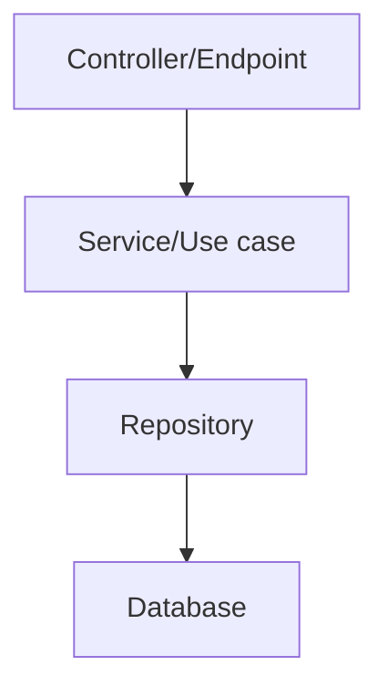

# Arquitectura de aplicaciones ASP.NET Core

Una API ASP.NET Core puede organizarse por capas, por dominio o con arquitectura hexagonal.

## Estructura por dominio

```txt
Products/
  ProductsController.cs
  ProductService.cs
  ProductRepository.cs
  ProductDtos.cs
Shared/
  Errors/
  Configuration/
```

## Capas



## Hexagonal

Para dominios complejos:

```txt
Domain -> Application ports -> Infrastructure adapters
```

## Buenas practicas

- Controladores finos.
- Servicios testeables.
- Persistencia detrás de repositorios si aporta valor.
- DTOs separados de entidades.
- No sobrediseñar CRUDs simples.
