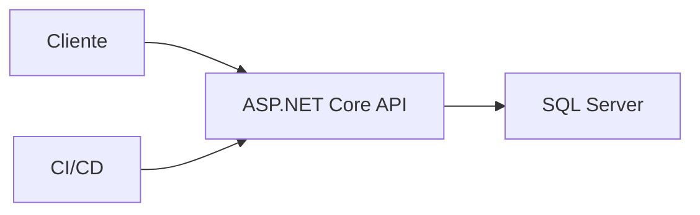

# Proyecto final

El objetivo es construir una API ASP.NET Core para tienda online con productos, pedidos, JWT, EF Core, SQL Server, tests y Docker.

## Arquitectura



## Endpoints

```txt
GET    /api/products
GET    /api/products/{id}
POST   /api/products
POST   /api/auth/login
POST   /api/orders
GET    /api/orders/{id}
```

## Requisitos

- DTOs.
- Validación.
- EF Core + migraciones.
- JWT.
- ProblemDetails.
- Health checks.
- Tests de integración.
- Dockerfile.

## Entregable

- API funcional.
- Modelo relacional.
- Migraciones.
- Seguridad en endpoints de escritura.
- Tests.
- Pipeline CI.
- README de despliegue.
