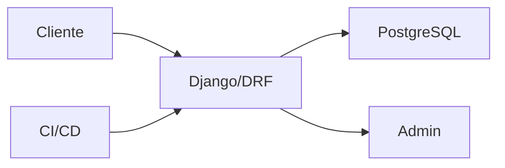

# Proyecto final

El objetivo es construir una API Django + DRF para tienda online con productos, pedidos, auth, admin, tests y despliegue.

## Arquitectura



## Apps

```txt
products
orders
accounts
```

## Endpoints

```txt
GET    /api/products/
POST   /api/products/
POST   /api/auth/login/
POST   /api/orders/
GET    /api/orders/{id}/
```

## Requisitos

- Modelos con constraints.
- Serializers DRF.
- ViewSets.
- Permisos.
- Admin personalizado.
- Tests.
- Dockerfile.

## Entregable

- API funcional.
- Admin operativo.
- Auth y permisos.
- Tests de modelos y API.
- Configuración segura.
- README de despliegue.
