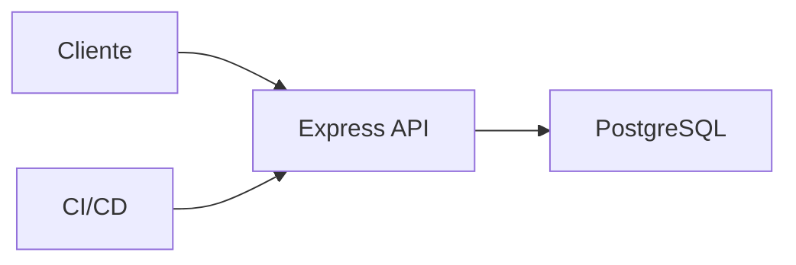

# Proyecto final

El objetivo es construir una API Express de tienda con productos, pedidos, auth, PostgreSQL, tests, seguridad y despliegue.

## Arquitectura



## Endpoints

```txt
GET    /api/products
POST   /api/products
POST   /api/auth/login
POST   /api/orders
GET    /api/orders/:id
```

## Requisitos

- Rutas por dominio.
- Validación con Zod.
- Prisma o pg.
- JWT.
- Error handler global.
- Tests con Supertest.
- Dockerfile.

## Entregable

- API modular.
- Persistencia y migraciones.
- Auth.
- Seguridad básica.
- Tests.
- CI.
- README de despliegue.
