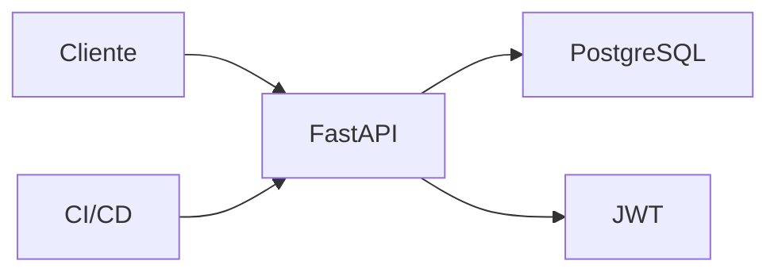

# Proyecto final

El objetivo es construir una API FastAPI de tienda con productos, usuarios, JWT, PostgreSQL, tests, OpenAPI y despliegue.

## Arquitectura



## Endpoints

```txt
GET    /products
GET    /products/{id}
POST   /products
POST   /auth/login
GET    /me
POST   /orders
```

## Estructura

```txt
app/
  main.py
  products/
  orders/
  auth/
  core/
tests/
```

## Requisitos

- Pydantic para request/response.
- SQLAlchemy + Alembic.
- JWT.
- Tests de endpoints.
- OpenAPI documentado.
- Dockerfile.
- Health check.

## Entregable

- CRUD de productos.
- Login y endpoint protegido.
- Creacion de pedidos.
- Validacion y errores consistentes.
- Tests.
- Docker Compose con PostgreSQL.
- Pipeline CI.
