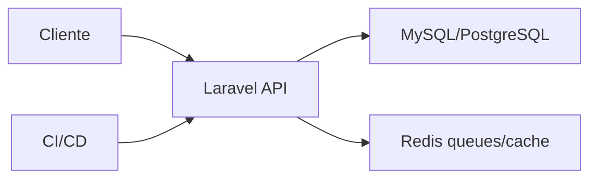

# Proyecto final

El objetivo es construir una API Laravel de tienda con productos, pedidos, auth, colas, tests y despliegue.

## Arquitectura



## Endpoints

```txt
POST /api/login
GET  /api/products
POST /api/products
POST /api/orders
GET  /api/orders/{id}
```

## Requisitos

- Eloquent models.
- Migrations.
- Form Requests.
- API Resources.
- Sanctum.
- Queues para email.
- Tests feature.

## Entregable

- API funcional.
- Auth y permisos.
- Jobs idempotentes.
- Tests.
- CI.
- README de despliegue.
