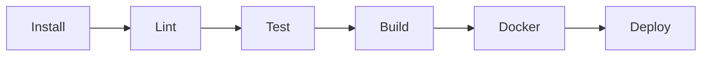

# CI/CD para NestJS

Una pipeline de NestJS debe validar tipos, lint, tests, build e imagen Docker.

## Pipeline



## GitHub Actions

```yaml
name: nestjs-ci

on:
  pull_request:
  push:
    branches: [main]

jobs:
  build:
    runs-on: ubuntu-latest
    steps:
      - uses: actions/checkout@v4
      - uses: actions/setup-node@v4
        with:
          node-version: 22
          cache: npm
      - run: npm ci
      - run: npm run lint
      - run: npm test
      - run: npm run build
```

## Buenas practicas

- CI en cada PR.
- Build reproducible.
- Tests e2e para endpoints criticos.
- Imagen con SHA.
- Secrets fuera de logs.
- Smoke test tras despliegue.
