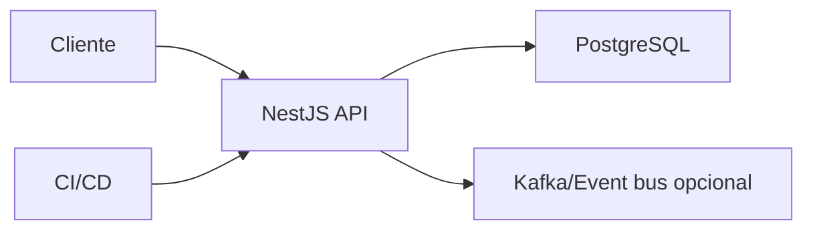

# Proyecto final

El objetivo es construir una API NestJS de tienda con productos, pedidos, JWT, PostgreSQL, testing, eventos y despliegue.

## Arquitectura



## Modulos

```txt
AuthModule
ProductsModule
OrdersModule
HealthModule
```

## Endpoints

```txt
POST /auth/login
GET  /products
POST /products
POST /orders
GET  /orders/:id
```

## Requisitos

- DTOs con validacion.
- JWT.
- Prisma o TypeORM.
- Tests unitarios y e2e.
- Filtros de error.
- Logs estructurados.
- Dockerfile.

## Entregable

- API modular.
- Persistencia con migraciones.
- Autenticacion y autorizacion.
- Evento `order.created`.
- Tests.
- CI.
- Despliegue Docker.
