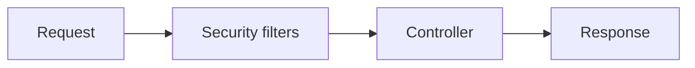

# Seguridad con Spring Security

Spring Security protege autenticacion, autorizacion, sesiones, filtros y endpoints. Es potente, pero conviene configurarlo de forma explicita.

## Cadena de filtros

Spring Security funciona mediante filtros HTTP.



## Configuracion basica

```java
@Bean
SecurityFilterChain security(HttpSecurity http) throws Exception {
  return http
    .csrf(csrf -> csrf.disable())
    .authorizeHttpRequests(auth -> auth
      .requestMatchers("/actuator/health").permitAll()
      .requestMatchers(HttpMethod.GET, "/api/products/**").permitAll()
      .anyRequest().authenticated()
    )
    .oauth2ResourceServer(oauth -> oauth.jwt())
    .build();
}
```

Para APIs stateless con JWT, CSRF suele desactivarse. Para apps con cookies, hay que tratarlo con cuidado.

## Autenticacion vs autorizacion

- Autenticacion: quien eres.
- Autorizacion: que puedes hacer.

## JWT

Un JWT no debe contener secretos ni informacion sensible innecesaria.

Valida:

- Firma.
- Expiracion.
- Issuer.
- Audience.
- Claims necesarios.

## Method security

```java
@PreAuthorize("hasRole('ADMIN')")
public void deleteProduct(Long id) {}
```

Activar:

```java
@EnableMethodSecurity
```

## CORS

No abras CORS con `*` sin entender consecuencias.

```java
@Bean
CorsConfigurationSource corsConfigurationSource() {
  CorsConfiguration config = new CorsConfiguration();
  config.setAllowedOrigins(List.of("https://app.example.com"));
  config.setAllowedMethods(List.of("GET", "POST", "PUT", "DELETE"));
  config.setAllowedHeaders(List.of("Authorization", "Content-Type"));
  UrlBasedCorsConfigurationSource source = new UrlBasedCorsConfigurationSource();
  source.registerCorsConfiguration("/**", config);
  return source;
}
```

## Buenas practicas

- Deniega por defecto.
- Protege endpoints de escritura.
- Valida tokens completamente.
- Usa HTTPS.
- No guardes secretos en el repo.
- Cubre autorizacion con tests.
- Separa seguridad de frontend y backend: ocultar botones no protege.
