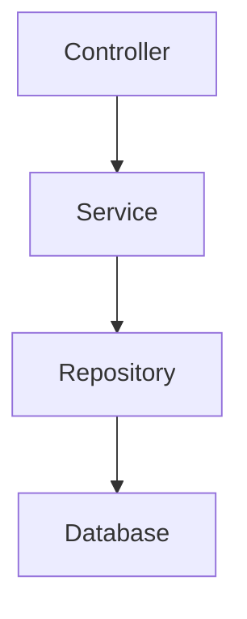
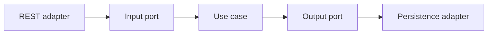

# Arquitectura por capas y hexagonal

Spring Boot no obliga a una arquitectura. Puedes construir desde una API simple por capas hasta un diseño hexagonal para dominios mas complejos.

## Capas clasicas



Funciona bien en CRUDs y aplicaciones pequeñas.

## Problema habitual

La logica de negocio acaba mezclada con:

- HTTP.
- JPA.
- DTOs externos.
- Configuracion de frameworks.

## Arquitectura hexagonal



El dominio no depende de Spring, HTTP ni base de datos.

## Paquetes

```txt
orders/
  domain/
    Order.java
    OrderStatus.java
  application/
    CreateOrderUseCase.java
    OrderRepositoryPort.java
  infrastructure/
    web/
    persistence/
```

## Puerto de salida

```java
interface OrderRepositoryPort {
  Order save(Order order);
  Optional<Order> findById(OrderId id);
}
```

## Adaptador JPA

```java
@Repository
class JpaOrderRepositoryAdapter implements OrderRepositoryPort {
  private final SpringDataOrderRepository repository;

  public Order save(Order order) {
    return mapper.toDomain(repository.save(mapper.toEntity(order)));
  }
}
```

## Cuándo usar hexagonal

Tiene sentido si:

- El dominio es importante.
- Hay multiples entradas o salidas.
- Quieres testear casos de uso sin Spring.
- La persistencia puede cambiar o no debe contaminar dominio.

Para CRUD simple, puede ser excesivo.

## Buenas practicas

- No uses arquitectura compleja por estetica.
- Protege dominio cuando haya reglas reales.
- Mantén mappers claros.
- Testea casos de uso sin levantar contexto Spring.
- Evita que entidades JPA sean tu modelo de dominio si el dominio crece.

