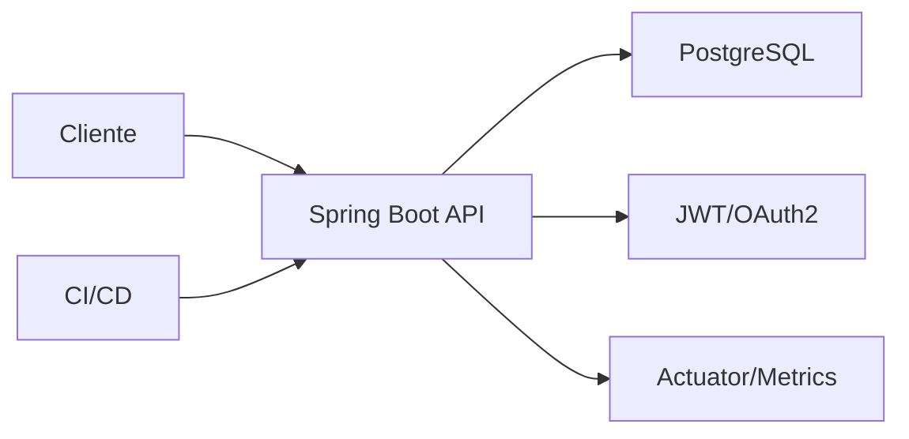

# Proyecto final

El objetivo es construir una API Spring Boot de tienda online con productos, pedidos, seguridad, PostgreSQL, observabilidad, tests y despliegue.

## Arquitectura



## Modulos funcionales

- Productos.
- Pedidos.
- Usuarios/autenticacion.
- Errores compartidos.
- Observabilidad.

## Endpoints

```txt
GET    /api/products
GET    /api/products/{id}
POST   /api/products
PUT    /api/products/{id}
DELETE /api/products/{id}
POST   /api/orders
GET    /api/orders/{id}
```

## Modelo base

```sql
CREATE TABLE products (
  id BIGSERIAL PRIMARY KEY,
  name TEXT NOT NULL,
  sku TEXT NOT NULL UNIQUE,
  price NUMERIC(12,2) NOT NULL CHECK (price >= 0),
  stock INT NOT NULL CHECK (stock >= 0)
);

CREATE TABLE orders (
  id BIGSERIAL PRIMARY KEY,
  status TEXT NOT NULL,
  created_at TIMESTAMPTZ NOT NULL DEFAULT now()
);
```

## Caso de uso: crear pedido

```txt
1. Validar request.
2. Comprobar productos.
3. Comprobar stock.
4. Crear pedido.
5. Descontar stock.
6. Confirmar transaccion.
7. Devolver respuesta.
```

Debe ejecutarse dentro de transaccion.

## Tests minimos

- Crear producto valido.
- Rechazar producto con precio negativo.
- Buscar producto inexistente devuelve 404.
- Crear pedido descuenta stock.
- Pedido sin stock devuelve conflicto.
- Endpoint protegido exige autenticacion.
- Repositorio funciona con PostgreSQL real mediante Testcontainers.

## Observabilidad

Configurar:

```txt
/actuator/health
/actuator/metrics
/actuator/prometheus
```

Logs con correlation id.

## Docker Compose

```yaml
services:
  api:
    build: .
    environment:
      SPRING_PROFILES_ACTIVE: prod
      SPRING_DATASOURCE_URL: jdbc:postgresql://db:5432/shop
      SPRING_DATASOURCE_USERNAME: shop
      SPRING_DATASOURCE_PASSWORD: shop
    ports:
      - "8080:8080"
    depends_on:
      - db

  db:
    image: postgres:16
    environment:
      POSTGRES_USER: shop
      POSTGRES_PASSWORD: shop
      POSTGRES_DB: shop
    volumes:
      - postgres_data:/var/lib/postgresql/data

volumes:
  postgres_data:
```

## Entregable

La API final debe tener:

- CRUD de productos.
- Creacion de pedidos transaccional.
- Validacion y errores consistentes.
- Seguridad en endpoints de escritura.
- Migraciones SQL.
- Tests unitarios, web y de integracion.
- Actuator y metricas.
- Dockerfile y Compose.
- Pipeline CI.

