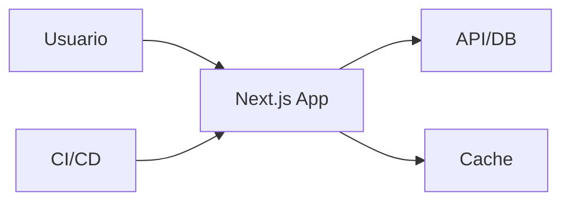

# Proyecto final

El objetivo es construir un dashboard Next.js de productos con App Router, autenticacion, cache, Server Actions, SEO, testing y despliegue.

## Funcionalidades

- Login.
- Dashboard privado.
- Listado de productos.
- Detalle de producto.
- Crear producto con Server Action.
- Revalidacion de cache.
- Metadata por pagina.
- Tests y build CI.

## Arquitectura



## Rutas

```txt
/login
/dashboard
/products
/products/[id]
/products/new
```

## Cache

Listado:

```tsx
fetch("/api/products", { next: { tags: ["products"] } })
```

Crear:

```tsx
revalidateTag("products")
```

## Seguridad

- Cookies httpOnly.
- Middleware para dashboard.
- Permisos en Server Actions.
- Variables privadas solo en servidor.

## Testing

- Render de listado.
- Formulario con validacion.
- Server Action con usuario sin permisos.
- E2E login y crear producto.

## Entregable

- App Router completo.
- Server Components por defecto.
- Client Components pequeños.
- Cache documentada.
- Auth protegida.
- Metadata e imagenes.
- CI con build.
- Despliegue reproducible.

