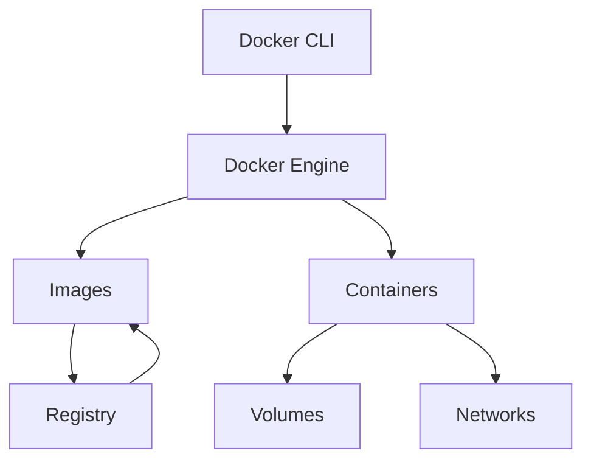

# Guia completa de Docker

Docker permite empaquetar aplicaciones con sus dependencias en imagenes reproducibles y ejecutarlas como contenedores. Es una herramienta base para desarrollo local, pruebas, despliegues, laboratorios de bases de datos y entornos consistentes.

Este manual busca ir mas alla de los comandos: explica como funciona Docker por dentro, como disenar imagenes mantenibles, como diagnosticar problemas y como llevar una aplicacion real hacia un entorno parecido a produccion.

Docker Compose tiene su propio manual en [Cloud](../../cloud/docker-compose/01-introduccion-y-casos-de-uso.md). Aqui se usa cuando aporta contexto al proyecto final, pero el detalle de Compose vive alli para evitar duplicar contenido.

## Capitulos

1. [Introduccion](01-introduccion.md)
2. [Imagenes y Dockerfile](02-imagenes-y-dockerfile.md)
3. [Contenedores](03-contenedores.md)
4. [Volumenes y redes](04-volumenes-y-redes.md)
5. [Logs, debug y diagnostico](05-logs-debug-y-diagnostico.md)
6. [Buenas practicas](06-buenas-practicas.md)
7. [Arquitectura interna](07-arquitectura-interna.md)
8. [Capas y overlay filesystem](08-capas-y-overlay-filesystem.md)
9. [Namespaces y cgroups](09-namespaces-y-cgroups.md)
10. [Registries y distribucion de imagenes](10-registries-y-distribucion.md)
11. [Seguridad](11-seguridad.md)
12. [Docker en desarrollo local](12-docker-en-desarrollo-local.md)
13. [Nginx y despliegue de aplicaciones](13-nginx-y-despliegue.md)
14. [CI/CD con Docker](14-ci-cd-con-docker.md)
15. [Troubleshooting](15-troubleshooting.md)
16. [Proyecto final](16-proyecto-final.md)

## Mapa mental



## Conceptos clave

- **Imagen:** plantilla inmutable con sistema de archivos, dependencias y configuracion.
- **Contenedor:** proceso aislado creado a partir de una imagen.
- **Dockerfile:** receta declarativa para construir una imagen.
- **Build context:** conjunto de archivos que Docker recibe durante el build.
- **Volume:** almacenamiento persistente gestionado por Docker.
- **Bind mount:** montaje de una ruta del host dentro del contenedor.
- **Network:** red virtual para conectar contenedores.
- **Registry:** repositorio de imagenes, como Docker Hub o GitHub Container Registry.

## Instalacion y comprobacion

```bash
docker --version
docker version
docker info
docker run hello-world
```

## Primer contenedor

```bash
docker run --name web-demo -p 8080:80 nginx:alpine
```

Abrir:

```txt
http://localhost:8080
```

Detener y eliminar:

```bash
docker stop web-demo
docker rm web-demo
```

## Que problema resuelve

Docker reduce diferencias entre maquinas:

```txt
mi maquina funciona
servidor falla
dependencia cambia
version del runtime distinta
```

Con Docker, el runtime, librerias y configuracion base viajan como imagen. Eso no elimina todos los problemas, pero hace el entorno mucho mas reproducible.

## Cuando usar Docker

- Entornos locales reproducibles.
- APIs y servicios backend.
- Bases de datos para desarrollo.
- Pipelines de CI.
- Builds consistentes.
- Despliegues empaquetados.
- Laboratorios de tecnologias.

## Cuando no basta con Docker

Docker no sustituye:

- Orquestacion compleja.
- Gestion de secretos.
- Observabilidad.
- Backups.
- Hardening de servidores.
- Diseno de despliegue.

## Idea clave

Docker no es una maquina virtual ligera. Un contenedor es un proceso aislado que comparte el kernel del host y usa mecanismos del sistema operativo como namespaces, cgroups y capas de filesystem.
